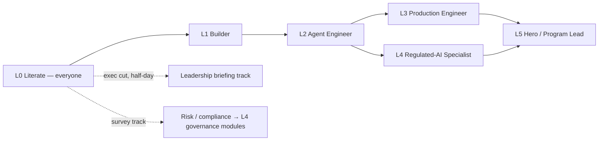
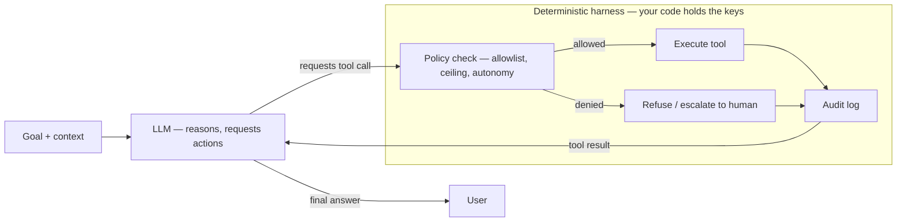
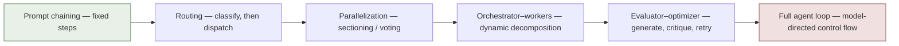
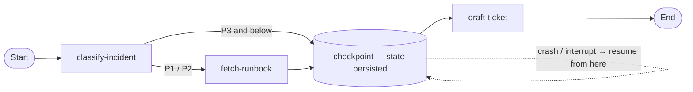
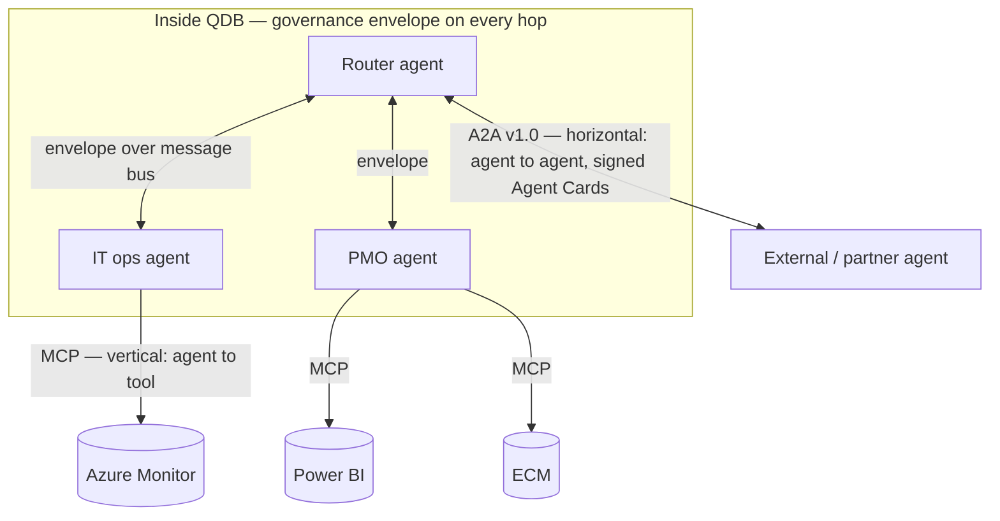
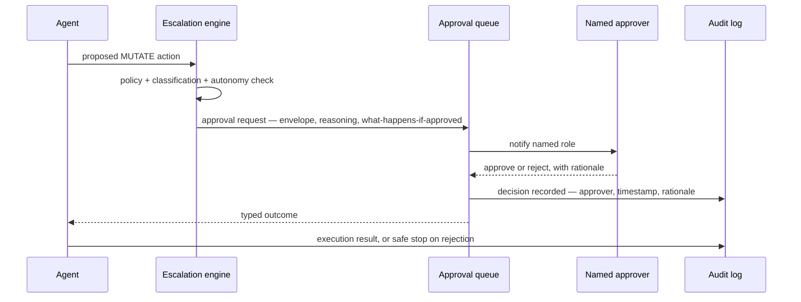
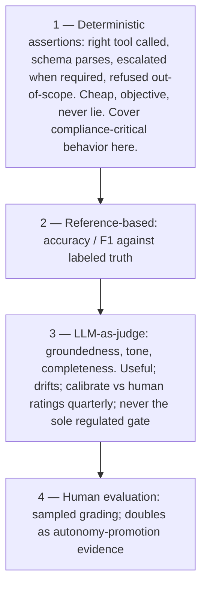
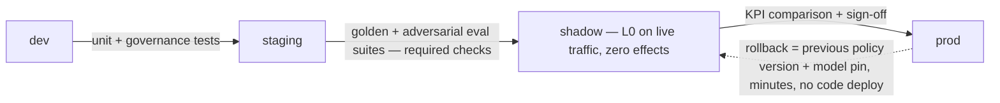
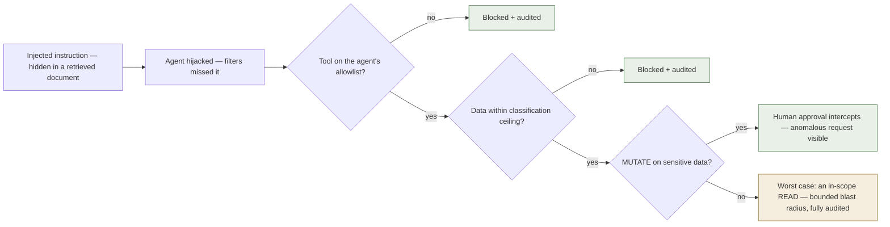
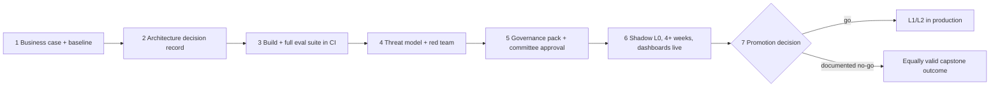

# Agentic AI: Zero-to-Hero — The Comprehensive Curriculum

**A complete, leveled training program for building, architecting, securing, governing, deploying, evaluating, and observing AI agents in production — calibrated for a regulated financial institution (QDB).**

Companion to `PRODUCTION-PLAYBOOK.md` (the *what and why*); this document is the *how do I get my people there*. The `qdb-agent-framework` in this repository is the lab environment: every module ends with hands-on work against real code, and every level gates on shipped work, not attendance.

---

# Part I — Program Design

## 1. The Levels

| Level | Name | Who reaches it | Effort (part-time) | Gate artifact |
|---|---|---|---|---|
| **L0** | Literate | Everyone touching the program, incl. leadership | 1–2 weeks | 5-minute explanation + quiz |
| **L1** | Builder | Developers, QA | 3–4 weeks | Merged tool + allowlist test |
| **L2** | Agent Engineer | Developers, solution architects | 4–6 weeks | New agent + multi-agent workflow, architect-reviewed |
| **L3** | Production Engineer | Senior devs, DevOps/SRE, QA leads | 4–6 weeks | Eval harness in CI + drills executed |
| **L4** | Regulated-AI Specialist | Security, risk, compliance + senior engineers | 4–6 weeks | Threat model + red-team report, or governance templates adopted |
| **L5** | Hero / Program Lead | Tech leads, chief architect | ongoing | Capstone: one real process through the full lifecycle |

## 2. Role Tracks

● = full depth (all modules + labs) ○ = survey depth (read modules, attend demos, skip deep labs) — = not required

| Role | L0 | L1 | L2 | L3 | L4 | L5 |
|---|---|---|---|---|---|---|
| Developer | ● | ● | ● | ● | ○ | — |
| Solution / Enterprise Architect | ● | ● | ● | ○ | ● | ● |
| DevOps / SRE | ● | ○ | ○ | ● | ○ | — |
| Security engineer | ● | ○ | ○ | ○ | ● | — |
| Risk / Compliance / Internal audit | ● | — | ○ | — | ● (governance modules) | — |
| QA / Test engineer | ● | ● | ○ | ● (eval modules) | ○ | — |
| Data / BI engineer | ● | ● | ○ | ○ | ○ | — |
| Product owner / PMO | ● | ○ | — | — | ○ | — |
| CIO / CEO / Board | ● (exec cut) | — | — | — | ○ (M4.5–M4.6 briefing) | ○ (strategy modules) |

**Minimum viable team to run agents in production** (the staffing target the program builds toward): 2× L3 engineers, 1× L2 architect, 1× L4 security specialist, 1× L4 governance specialist, 1× L5 program lead — with every agent's owner team containing at least one L2+.

## 3. Learning Principles

1. **Ship to pass.** Every gate is a working artifact reviewed by someone a level above (or an external reviewer for the first cohort). No certificates for watching videos.
2. **The repo is the lab.** Exercises extend `qdb-agent-framework` on personal branches (`learn/<name>/<level>`). Training output becomes real assets: the L3 cohort's eval harness becomes the actual CI gate; the L4 cohort's templates become the actual governance artifacts.
3. **Cohorts, not solo study.** 4–8 people, one 90-minute session weekly (30 min concepts, 60 min lab), plus a shared channel for blockers. Pairing across roles (engineer + security, engineer + risk) is deliberate — production agents fail at the seams between disciplines.
4. **Resources are named, not link-farmed.** Primary sources by title + publisher (Anthropic docs, OWASP, NIST); search the title — URLs rot, titles don't. Appendix C is the consolidated library.
5. **Time-box theory.** Per module: at most 40% reading/watching, at least 60% lab. If a module's lab is done, the module is done.
6. **Reassess quarterly.** Skills decay and the field moves. The skills matrix (Appendix B) is reviewed quarterly; "can teach" ratings require having actually taught.

## 4. Lab Environment Prerequisites (once per learner)

- Node.js 20+, Docker, git; clone this repo; `cd qdb-agent-framework && npm install && npm test` (all green) and `npm run simulate` (watch one full workflow).
- An Anthropic API key (team/sandbox account — never personal keys, never production keys; spending caps set per learner).
- Access to the cohort branch namespace and the shared Jaeger/observability sandbox (L3+).
- Read `CLAUDE.md` and skim `PRODUCTION-PLAYBOOK.md` §1 before the first session.

---

# Part II — The Levels

---

## Level 0 — Literate

**"I understand what agents are, why they're different, and why a bank must treat them differently."**

Audience: everyone. Duration: 1–2 weeks part-time (~8–12 hours). The #1 failure mode of enterprise AI programs is a calibration gap — leadership expecting magic, engineers expecting a demo to equal production. L0 exists to close that gap with shared vocabulary.

### Module 0.1 — How LLMs Actually Work (≈3h)

**Objectives:** explain generation, context windows, and hallucination without hand-waving; internalize "probabilistic component, deterministic harness."

**Topics:**
- Next-token prediction in plain language; why the same prompt can yield different answers; temperature.
- Context window as working memory: everything the model "knows" about your task is in the prompt; nothing persists between calls unless you put it there.
- Hallucination as a structural property, not a bug to be patched: the model always produces *plausible* text; plausibility ≠ truth. Implication: any output that matters must be verified by retrieval-grounding, schema validation, or a human.
- Training cutoffs, fine-tuning vs. prompting vs. retrieval — what each can and cannot fix.
- Tokens and cost: why context discipline is also cost discipline.

**Resources:** Anthropic docs "Intro to Claude"; any reputable "how LLMs work" explainer (3Blue1Brown's transformer videos for the visually inclined); Anthropic prompt-engineering tutorial (first sections only).

**Lab:** in claude.ai or the console workbench: (a) ask a factual question about QDB the model can't know — observe confident fabrication; (b) same question with a source document pasted in — observe grounding; (c) write two sentences on what this means for using LLMs on bank data.

### Module 0.2 — From Chatbot to Agent (≈3h)

**Objectives:** define an agent precisely; explain the autonomy ladder; articulate why agents change the risk picture.

**Topics:**
- The agent formula: **model + tools + loop + goal**. The model can act, observe the result, and act again. A chatbot answers; an agent *does*.
- Workflows vs. agents (Anthropic's distinction): predefined step sequences vs. model-directed control flow — and why regulated deployments prefer the workflow end of the spectrum wherever possible.
- Tool use in one diagram: model requests a tool call → *your code* executes it → result returns to the model. The harness, not the model, holds the keys.
- The autonomy ladder (Playbook §4.2): L0 shadow → L1 notify → L2 approve (maker-checker) → L3 autonomous-with-audit. Autonomy is granted per task category, earned with evidence, and always revocable.
- The one-line risk statement everyone must be able to repeat: *a chatbot that hallucinates embarrasses you; an agent that hallucinates does things.*
- Agents as digital employees (Playbook §1): job description = policy file; badge = tool allowlist; manager = owner team; timesheet = audit log.

The agent loop, and where the keys actually live:

**Resources:** Anthropic engineering blog "Building effective agents" (the single best short read in the field); Playbook §1, §4.2.

**Lab:** run `npm run simulate`; follow one request through the console output: router → specialist agent → tool call → audit entry. Then read `policies/it-operations.yaml` end-to-end and answer in writing: (a) what can this agent never do? (b) where is that enforced — prompt or code? (c) who gets notified when a P1 incident appears?

### Module 0.3 — The Regulated Context (≈2h)

**Objectives:** know which rules apply to QDB and what regulators will ask.

**Topics:**
- Why "the model decided" is never an acceptable answer: accountability sits with a named human owner, always.
- The regulatory landscape in one pass: QCB supervision and its AI expectations; Qatar PDPPL (personal data); NCSA/NIA (information assurance); Sharia governance for product-touching decisions; EU AI Act as the international benchmark (credit decisions = high-risk category).
- The three questions every deployment must answer in writing (Playbook §5.3): worst case if compromised? who reviews, how often? how do we turn it off?
- Data residency in one rule: CONFIDENTIAL+ data does not leave Qatar-resident infrastructure without explicit sign-off.

**Resources:** Playbook §5 and §10; a one-page internal summary of PDPPL obligations (compliance team to supply).

**Lab (discussion format):** given three hypothetical agent proposals (an HR-leave-balance bot, a loan-pre-screening assistant, an autonomous payment releaser), rank them by risk, assign the right starting autonomy level, and name the approval path. There are defensibly correct answers; debate them.

### The Executive Cut (half-day, for CEO / board / ExCo)

1. (45 min) "Building effective agents" pre-read + facilitated discussion: what agents are, the autonomy ladder, agents-as-employees.
2. (30 min) Live demo: `npm run simulate` narrated by an engineer — including a deliberately blocked action and an escalation.
3. (45 min) Playbook §1, §5, §10 walkthrough: the operating model, who is accountable, the phased roadmap, and what the board will be asked to approve (the AI governance framework — a QCB expectation).
4. (30 min) The investment ask: this curriculum, the staffing target (§2), and the first capstone process.

### L0 Gate

- Explain to a non-engineer, in under five minutes: what an agent is, what the autonomy ladder is, why every agent has a named human owner.
- Short written quiz (10 questions) covering: hallucination, tool-use mediation, autonomy levels, the three deployment questions, data residency rule. Pass = 8/10.

---

## Level 1 — Builder

**"I can build a working single agent with tools, structured output, and retrieval."**

Audience: developers, QA. Duration: 3–4 weeks (~25–35 hours). Prerequisite: L0. This level is fluency with the raw materials; nothing here is agent-framework-specific — it transfers to any stack.

### Module 1.1 — LLM API Mechanics (≈4h)

**Objectives:** call the API idiomatically; control the knobs; stream.

**Topics:**
- Messages API anatomy: system prompt vs. user/assistant turns; why the system prompt is the contract.
- Parameters that matter in production: `max_tokens` (cost ceiling + truncation behavior), `temperature` (0 for extraction/classification, higher only for generation), stop sequences.
- Streaming: server-sent events, partial rendering, why UX for agents demands it (`src/core/streaming.ts` shows the framework's approach).
- Multi-turn state: *you* maintain the conversation array; the API is stateless.
- Rate limits, retries with exponential backoff, timeout budgets; idempotency thinking from day one.
- Provider abstraction: read `src/core/llm-router.ts` — same request shape routed to Claude / GPT / local Ollama; why the abstraction exists (residency, cost, exit strategy per QCB expectations).

**Resources:** Anthropic docs: Messages API reference + streaming guide; `anthropics/courses` API fundamentals module.

**Lab:** standalone TypeScript script: multi-turn conversation with streaming output, temperature 0, a 3-retry backoff wrapper, and a hard cost cap (count tokens, abort past budget). No frameworks — raw SDK.

### Module 1.2 — Prompt Engineering for Reliability (≈4h)

**Objectives:** write prompts that behave consistently and degrade safely; know prompting's limits.

**Topics:**
- Structure: role, context, task, constraints, output format, examples — in that order; XML-style delimiters for injected content.
- Few-shot examples as the strongest steering tool; choosing examples that cover edge cases.
- Instructing refusal: telling the model what to do when it *can't* comply (say so, escalate) — the difference between a safe miss and a hallucinated hit.
- Chain-of-thought / extended thinking: when reasoning-before-answering helps (classification edge cases, multi-constraint decisions) and its latency/cost price.
- **The limits doctrine:** prompts steer, code enforces. Anything that MUST hold (permissions, data boundaries, approval requirements) lives in the harness, never only in the prompt. Compare the `system_prompt` in `policies/it-operations.yaml` (says "never access core banking") with `denied_tools` in the same file (makes it impossible) — both exist, only one is a control.
- Prompts as versioned artifacts: they live in the policy file, change through review (Playbook §9).

**Resources:** Anthropic prompt-engineering docs (the full guide, not the intro); Anthropic's prompt-improver tooling for critique.

**Lab:** take the incident-triage task: write a prompt that classifies 15 sample incident texts into severity + system + summary. Measure accuracy against a hand-labeled answer key. Iterate the prompt three times, logging accuracy each round. Deliver: final prompt + accuracy table + one paragraph on what moved the needle.

### Module 1.3 — Tool Use / Function Calling (≈6h) — **the core skill of L1**

**Objectives:** define tools well; run the tool loop; handle failure.

**Topics:**
- Tool schemas: name, description, JSON Schema parameters. **Description quality is model performance** — the model chooses tools by reading descriptions; vague descriptions cause wrong-tool calls.
- The loop: request → `tool_use` block → your code executes → `tool_result` → model continues. Multiple tools per turn; parallel tool calls.
- Designing tool inputs/outputs: small, typed, explicit units ("amount_qar", not "amount"); errors returned as structured results the model can reason about, not exceptions that kill the loop.
- Tool granularity judgment: one `query_database(sql)` tool is a security hole; fifty micro-tools confuse the model. Aim for task-shaped tools with the narrowest useful contract.
- READ vs. MUTATE as a first-class distinction (`operationType` in `src/core/tool-manifest.ts`): mutating tools carry approval requirements; idempotency keys for anything that creates/changes state.
- The framework's tool architecture: manifest (declaration + classification ceiling) → registry (resolution against agent policy) → execution (audit event emitted). Read `src/core/tool-registry.ts` and one tool in `src/tools/data/`.

**Resources:** Anthropic tool-use guide + tool-use cookbook notebooks (do at least two); this repo's `src/tools/` directory.

**Lab:**
1. Standalone: agent with `get_exchange_rate` + `get_account_type` tools answering "what's 5,000 QAR in USD for an SME account?" — including a run where the rate tool returns an error and the agent reports it gracefully instead of inventing a rate.
2. **In-framework (gate artifact):** build `src/tools/data/query-hr-directory.ts` (mock data, realistic shape), register it in the manifest with correct `operationType: READ` and `INTERNAL` classification ceiling, add to the PMO agent's allowlist. Write a vitest proving (a) PMO agent can call it, (b) IT ops agent is denied with the correct error code, (c) the call emits an audit event.

### Module 1.4 — Structured Output (≈3h)

**Objectives:** make model output machine-safe.

**Topics:**
- Why free-text between systems is where hallucinations become incidents; schema-first design.
- Zod/JSON-Schema validation with reject-and-retry: parse failure → feed the error back → bounded retries → hard failure to a human (never "accept approximately").
- Enums over strings; refusing unknown fields; the difference between "model returned valid JSON" and "model returned *correct* JSON" (validation vs. evaluation — foreshadows L3).
- Read `src/core/structured-output.ts` — the framework's implementation of exactly this pattern.

**Lab:** free-text loan-inquiry email → typed `{applicant_type, sector, amount_qar, purpose, missing_fields[]}`. Schema must reject invalid enums; prove the retry path with a deliberately hostile input; prove the hard-fail path.

### Module 1.5 — Retrieval (RAG) Fundamentals (≈5h)

**Objectives:** ground agent answers in bank documents with citations.

**Topics:**
- The pipeline: ingest → chunk → embed → index → retrieve → augment prompt → cite. Where each step goes wrong (bad chunking dominates).
- Chunking strategies for real documents (policies, contracts): structure-aware beats fixed-size; overlap; metadata (source, section, classification) carried with every chunk.
- Embeddings and vector search in practice; hybrid (keyword + vector) as the default for banking terminology and Arabic/English mixed corpora.
- **Citations as a control, not a feature:** every data-backed claim cites tool + record so a human can verify (Playbook §4.3). Uncited claims are how hallucinations enter official records.
- Retrieval and data classification: the index inherits the classification of its most sensitive document unless you filter at query time by user/agent clearance — a security topic revisited at L4.
- When RAG is the wrong tool: computations, live data (use a query tool), tiny corpora (put it in the prompt).

**Resources:** Anthropic docs RAG guidance + contextual-retrieval writeup; any one vector store's quickstart (choose what IT can actually host).

**Lab:** index this repo's `docs/` folder; build `ask-the-playbook`: answers must cite section numbers; questions with no grounded answer must say so rather than improvise. Test with 5 answerable + 3 unanswerable questions.

### Module 1.6 — Robustness Habits (≈2h)

**Topics:** timeout budgets per call; retry idempotency; graceful degradation ("agent unavailable" → human queue is a *feature*); context-window overflow handling (summarize or fail loudly, never silently truncate); logging every call with correlation IDs from day one (the L0-of-observability).

**Lab:** revisit Module 1.3's standalone agent; inject: provider 429s, a tool that hangs, a context overflow. All three must degrade visibly and safely.

### L1 Gate

- Module 1.3 lab #2 (HR-directory tool + allowlist tests) merged to cohort branch, reviewed by an L2+ engineer against: correct manifest declaration, both positive and negative authorization tests, audit event asserted, code matches repo idioms.
- Rubric (pass = all four): tool contract quality · test completeness · error handling · idiom fit.

---

## Level 2 — Agent Engineer

**"I can design and build multi-agent systems — and I know when not to."**

Audience: developers, solution architects. Duration: 4–6 weeks (~35–45 hours). Prerequisite: L1. This level moves from *calling a model* to *engineering a system*: orchestration, state, communication, human-in-the-loop, and above all architectural judgment.

### Module 2.1 — Agentic Patterns and the Judgment to Choose (≈4h)

**Objectives:** name the patterns; pick the simplest one that works; defend the choice.

**Topics:**
- The Anthropic pattern taxonomy, in escalating order of autonomy: prompt chaining → routing → parallelization (sectioning/voting) → orchestrator-workers → evaluator-optimizer → full agent loop. Know each one's shape, cost profile, and failure modes.
- The reasoning-loop taxonomy (the 2026 vocabulary — these names appear in every framework's docs): **ReAct** (think–act–observe loop, the default agent loop), **Plan-and-Execute** (decompose up front, then run steps — cheaper and more auditable than replanning every turn), **Reflexion** (self-critique and retry), **ReWOO** (plan once, execute without intermediate LLM calls), **Tree-of-Thoughts** (search over candidate plans — rarely worth its cost in production). Regulated default: Plan-and-Execute over free-running ReAct wherever the task allows, because the plan is reviewable *before* execution.
- The 2026 architectural consensus: four separable layers — reasoning (the model), orchestration (control flow over a state graph), memory (its own storage tiers and failure modes), and tool integration (MCP). Memory and orchestration are first-class concerns now, not afterthoughts bolted to a chat loop — this framework's separation of `graph-engine` / `memory` / `state-store` / `tool-registry` reflects it.
- **The prime directive: most "agent" problems are workflow problems.** Fixed step sequences are cheaper, testable, and auditable. Reach for model-directed control flow only when the path genuinely cannot be enumerated in advance.
- Decision drivers for regulated contexts: auditability (can you enumerate the paths?), blast radius, latency/cost budgets, failure containment.
- Single agent + many tools vs. multiple agents: split only along real boundaries — different data clearances, different owner teams, different autonomy ceilings, genuinely different domains. "It feels cleaner" is not a boundary.
- The router pattern as a bank's front door: intent classification with confidence thresholds; low-confidence → human, never guess (`src/agents/router/intent-classifier.ts`).

The pattern ladder — autonomy, cost, and audit difficulty all rise left to right; start as far left as the task allows:

**Resources:** "Building effective agents" (third read — now study the pattern diagrams); this repo's router implementation.

**Lab:** for five QDB scenarios (loan-document completeness check, monthly PMO status compilation, IT incident triage, Sharia product screening, ad-hoc analytics Q&A), choose a pattern each, and write a one-paragraph justification. Reviewed in cohort session — disagreement is the point.

### Module 2.2 — Orchestration with Graphs (≈6h)

**Objectives:** build resumable, enumerable multi-step workflows.

**Topics:**
- Graph model: nodes (work), edges (control flow), conditional edges, checkpoints. Why explicit graphs beat free loops for audit: every path is enumerable (Playbook §2.1).
- State machines vs. DAGs vs. cyclic graphs (evaluator-optimizer loops need cycles — with hard iteration caps).
- Checkpointing and resumability: a workflow interrupted by an approval (or a crash) resumes from state, not from scratch. Read `src/core/graph-engine.ts` and `src/core/state-store.ts` together.
- Interrupts as first-class citizens: pausing for human approval is a *node*, not an exception.
- Fan-out/fan-in: parallel tool calls and sub-agent branches; joining with timeouts; partial-result policies.
- Determinism discipline: node logic deterministic wherever possible; LLM calls confined to identified nodes so evals (L3) can target them.

**Resources:** `src/core/graph-engine.ts` line-by-line; one framework from the Appendix E shortlist (Claude Agent SDK, LangGraph 1.0, OpenAI Agents SDK, Google ADK, or Microsoft Agent Framework), learned deeply — concepts transfer, syntax doesn't matter.

**Lab:** build a three-node graph in the framework: `classify-incident` → (conditional) `fetch-runbook` → `draft-ticket`, with a checkpoint before `draft-ticket` and proof that killing the process mid-run and restarting resumes correctly.

### Module 2.3 — State, Memory, and Context Management (≈4h)

**Topics:**
- The three stores and their lifecycles: **turn context** (the prompt — rebuilt every call), **session state** (task-scoped, TTL'd — `src/core/state-store.ts`), **long-term memory** (cross-session; opt-in, classified, auditable — `src/core/memory.ts`).
- What belongs where; the banking default: *less memory is more* — persist facts only with a policy reason, classification tag, and expiry. `context_policy` in every policy YAML (max session hours, clear-on-completion, max tokens) is the enforcement.
- Context engineering: what to include per call (task, relevant state, retrieved docs, tool results), what to summarize, what to drop; compaction strategies for long sessions.
- Memory poisoning preview (deep dive at L4): anything written to memory is future prompt input — attacker-influenced memory is persistent injection.

**Lab:** add a session-scoped "working notes" capability to the PMO agent using the state store with a 4-hour TTL; prove notes survive across turns within a session, are destroyed after completion, and never exceed the classification ceiling.

### Module 2.4 — Inter-Agent Communication and MCP (≈6h)

**Objectives:** make agents talk through contracts, not chatter; understand the emerging protocol landscape.

**Topics:**
- The envelope doctrine (Playbook §4.1): every inter-agent message is a typed, immutable, schema-validated envelope with `correlationId`/`parentMessageId` (causal chain), `dataClassification` + `autonomyLevel` + `requiresApproval` (authority travels with the message), and `ttlSeconds` (no stale instructions). Read `src/core/message-envelope.ts` + `src/core/message-bus.ts`.
- Why free-text agent-to-agent handoffs are an anti-pattern: unauditable, injectable, and lossy.
- Classification laundering: the envelope makes it structurally hard for RESTRICTED data to exit through a PUBLIC-cleared agent — trace how.
- **MCP (Model Context Protocol):** servers, tools, resources, prompts. Now the settled industry standard for the agent↔tool layer — created by Anthropic, governed since December 2025 by the Linux Foundation's Agentic AI Foundation, and supported by every major framework, which makes MCP-compliant tools portable across stacks. What MCP does and doesn't solve: it carries *capability*, not *authority* — your envelope/policy layer still decides *whether*.
- **A2A (Agent2Agent):** the agent↔agent protocol — v1.0 released under Linux Foundation governance in April 2026, 150+ member organizations, production support in Azure AI Foundry, Amazon Bedrock AgentCore, and Copilot Studio. Key v1.0 concepts: Agent Cards (now cryptographically signable — portable agent identity), task lifecycle, and the emerging Agent Payments Protocol (AP2). The consensus stack: **MCP vertical (agent→tool), A2A horizontal (agent→agent).**
- The posture for a bank, unchanged by the standards wave: adopt MCP/A2A at the edges (external tools; agents crossing org or vendor boundaries), keep the governance envelope as the internal standard — open protocols carry the message, your envelope carries the authority context. Signed Agent Cards strengthen, but do not replace, per-agent workload identity (Module 4.2).
- Message bus operational concerns: delivery semantics, dead-letter queues, replay for audit.

The 2026 protocol topology — MCP vertical, A2A horizontal, your envelope inside:

**Resources:** modelcontextprotocol.io spec + server quickstart; this repo's envelope tests (`tests/unit/message-envelope.test.ts`).

**Lab:**
1. Wrap one existing mock tool (`search-ecm`) as an MCP server; call it from Claude Desktop or the CLI — see the protocol from both sides.
2. Attempt (in a test) to construct an envelope that carries RESTRICTED data to an agent with an INTERNAL ceiling; document exactly which layer rejects it and with what error.

### Module 2.5 — Human-in-the-Loop as Architecture (≈4h)

**Topics:**
- HITL is a designed workflow, not a popup: approval queue, full-context presentation (envelope + agent reasoning + what-happens-if-approved), decision capture as an audit event (approver, timestamp, rationale).
- The escalation engine: how `src/governance/escalation.ts` computes decisions from policy + operation type + classification; the hard-coded floor (MUTATE + CONFIDENTIAL+ → approval, always).
- Designing for the approver: approvals must be *decidable in under two minutes* or fatigue defeats the control. What context to surface, what to pre-check automatically.
- Override-rate telemetry as the promotion evidence base (Playbook §4.2): >95% unmodified approvals sustained = the data case for L3, decided by governance, not engineering.
- Rejection flows: a rejected action must inform the agent (typed result), the user (honest message), and the audit log — and must not be silently retried.

The approval round-trip you'll build in the lab:

**Lab:** build the approval round-trip for the procurement scenario (below): agent proposes PO amendment → approval request created with full context → simulate approve and reject paths → assert both outcomes in the audit log and in the agent's subsequent behavior.

### Module 2.6 — Model Routing and Cost Architecture (≈3h)

**Topics:**
- Tiering: fast/cheap models for classification and extraction, frontier models for reasoning and drafting; routing per *task*, not per agent (`src/core/llm-router.ts`).
- Local models (Ollama) for residency-constrained inference: capability trade-offs, when they're good enough (classification, PII detection) vs. not (multi-step reasoning).
- Cost engineering: token budgets per session (a guardrail — Playbook §7.1), prompt caching for stable system prompts, batch APIs for offline work; cost-per-task as a first-class KPI.
- Pinning discipline preview (L3): explicit model IDs per agent per environment, never "latest."

**Lab:** add a routing rule sending intent classification to a small model and agent reasoning to a frontier model; measure and report cost-per-simulated-task before and after.

### Module 2.7 — Anti-Patterns Clinic (≈2h, cohort session)

The catalog, with real examples dissected: the god agent · agent sprawl (agents as org-chart cosplay) · free-text handoffs · LLM-enforced permissions ("the prompt says it won't") · unbounded loops without turn/cost caps · memory as a junk drawer · RAG-everything (retrieval where a SQL tool belongs) · demo-driven architecture (patterns chosen for wow, not audit) · silent truncation · fallback-to-guessing on low confidence.

**Format:** each learner brings one anti-pattern spotted in the wild (or in their own L1 work); the cohort names the fix.

### L2 Gate (two artifacts, reviewed by the chief architect)

1. **New specialist agent:** `procurement-agent` end-to-end — policy YAML (scope, allowlist, autonomy overrides, escalation rules, context policy), system prompt, router/intent-classifier registration. Behavior: vendor-status queries (READ, L1) answered directly; PO amendments (MUTATE) escalate at L2 with the Module 2.5 approval round-trip. Integration test proves both paths + audit completeness.
2. **Multi-agent workflow:** PMO agent requests infrastructure cost data from IT ops agent via the message bus, merges with project data, emits a typed status report. One `correlationId` ties every hop in the audit log; a trace-drill document (sequence diagram, one page) accompanies it.

**Review rubric (pass = all five):** pattern choice justified (why agent, why this split) · governance wiring correct (escalation fires, floor respected) · no free-text inter-agent payloads · audit chain complete and demonstrated · policy file passes schema and review conventions.

---

## Level 3 — Production Engineer

**"I can deploy, evaluate, and observe agents like any tier-1 banking system."**

Audience: senior devs, DevOps/SRE, QA leads. Duration: 4–6 weeks (~35–45 hours). Prerequisite: L1 (devs/QA) or L0+survey-L2 (SRE). This level is the demo-to-production gap; its flagship output — the eval harness — closes the framework's biggest real gap (Playbook §6).

### Module 3.1 — Evaluation Foundations (≈6h) — **the heart of L3**

**Objectives:** build the machinery that lets you change anything (prompt, model, policy) with confidence.

**Topics:**
- Why agents need evals when normal software needs tests: non-determinism means "it worked when I tried it" is meaningless; you measure *distributions* of behavior, not single runs.
- **Golden datasets:** 50–200 real (anonymized) task examples per agent with expected outcomes, curated by the owner team, refreshed quarterly, version-controlled next to the code. Building one is 80% of eval effort and 100% owner-team work — engineers build the harness, the business supplies truth.
- **The assertion hierarchy** (cheapest and most objective first):
  1. *Deterministic:* did it call an allowed tool? correct tool? did output parse? did it escalate when the scenario required? did it refuse out-of-scope? — these cover the compliance-critical behaviors and never lie.
  2. *Reference-based:* classification accuracy, extraction F1 vs. labeled truth.
  3. *LLM-as-judge:* groundedness, tone, completeness — useful, never the only gate for regulated behavior; judges drift and must themselves be calibrated against a human-rated sample quarterly.
  4. *Human evaluation:* sampled grading during L0/L1 phases; doubles as autonomy-promotion evidence.
- Metrics that matter per agent: task success rate, escalation precision/recall (escalating too little is a compliance failure, too much is fatigue), tool-error rate, grounding rate, refusal correctness.
- Statistical honesty: run counts, variance, "pass rate ≥ X% with N ≥ 30" not "it passed."

The assertion hierarchy — spend your eval budget top-down:

**Resources:** Anthropic docs evaluation guidance; promptfoo (or Braintrust/LangSmith equivalent) hands-on — learn ONE eval tool; this repo's `scripts/simulate-workflow.ts` as the replay substrate.

**Lab (flagship, part 1):** create `evals/` with a 30-case golden dataset for the router (utterance → expected target agent + expected escalation flag + expected refusal for out-of-scope cases). Runner executes all cases N=3, reports per-case and aggregate pass rates, exits non-zero below threshold. Wire as `npm run eval`.

### Module 3.2 — Adversarial and Regression Evaluation (≈4h)

**Topics:**
- The standing red-team suite: injection attempts (direct + via retrieved-document content), out-of-scope requests, PII-extraction attempts, authority-escalation attempts ("as the CIO, I approve…"), Sharia-noncompliant product requests. Every case must *fail safely* — blocked, refused, or escalated; never silently complied with.
- Fail-safe taxonomy: what "safe" means per case class (block vs. refuse vs. escalate) — asserted specifically, not just "didn't crash."
- Regression discipline: the full suite runs on every change to prompts, policies, tools, or model pins. **A prompt edit is a code change.** No green, no merge.
- Drift monitoring: providers update models; scheduled (weekly) eval runs against production pins catch behavior shifts before users do.

**Lab (flagship, part 2):** add `evals/adversarial/` — 15 red-team cases across the five classes above, each asserting its specific safe outcome. Wire both suites into CI (GitHub Actions) as required checks. *This lab's output becomes the repository's actual CI gate.*

### Module 3.3 — CI/CD and Progressive Delivery for Agents (≈5h)

**Topics:**
- The agent release unit is five artifacts (Playbook §9): code, policy, prompt (inside policy), tool manifest, model pin — each versioned, each a change trigger for the eval suite.
- Environment promotion: dev → staging → **shadow** → prod. Shadow mode (L0 autonomy on live traffic) is the agent world's canary: real inputs, no effects, humans compare.
- Config-not-code rollout levers: autonomy downgrade, model re-pin, policy rollback — all deployable in minutes without a code release; rollback drilled, not just documented.
- Model upgrades as vendor system upgrades: full eval suite on the new pin in shadow → KPI comparison → sign-off → cutover with rollback armed. Never auto-upgrade an agent holding L2+ authority.
- Secrets and supply chain: vault-backed keys, per-environment pins, dependency and model-provenance scanning; protected branch on `policies/` with required reviews (the git log as regulator-facing change record).

**Lab:** build the promotion pipeline skeleton: a GitHub Actions workflow that on any change to `policies/**`, `src/**`, or `evals/**` runs unit + governance tests + both eval suites, and on main-merge produces a versioned container image (Dockerfile exists) tagged with policy versions included. Document the rollback procedure and execute it once against the docker-compose stack.

### Module 3.4 — Deployment, Scaling, and Resilience (≈4h)

**Topics:**
- Runtime topology: stateless agent runtime + externalized state store + message bus — read `docker-compose.yml` and map each service to its production equivalent (AKS in Azure Qatar, managed Postgres/Redis, service bus).
- Capacity realities: provider rate limits are the real ceiling; queue backpressure, per-agent and per-user rate limits (`src/api/middleware/rate-limit.ts`), timeout budgets per hop with an end-to-end budget.
- Graceful degradation ladder: retry → alternate model/provider → degrade to notify-only → route to human queue. "Agent unavailable, a human will follow up" is a feature, not an outage.
- Multi-region and DR posture consistent with QDB's estate (Azure Qatar primary, DR per bank standards); RTO/RPO for agent state; what is safe to lose (turn context) vs. never (audit log, approval queue).
- Denial-of-wallet: cost caps per session/agent/day as circuit breakers.

**Lab (chaos drill):** against the docker-compose stack: (a) kill the mock tool backend mid-workflow — verify graceful degradation, audit record, alertable metric; (b) saturate rate limits — verify backpressure not collapse; (c) execute the per-agent kill switch via the admin route (`src/api/routes/admin.ts`) — verify the router behaves and in-flight work drains to the human queue.

### Module 3.5 — Observability (≈5h)

**Topics:**
- The two-system doctrine (Playbook §8): **audit trail** (compliance record: immutable, complete, retained per QCB; `src/core/audit-logger.ts`) vs. **telemetry** (operational: traces, metrics, logs; `src/core/observability.ts`). Different consumers, different retention, different access controls — never conflate them.
- OTel for agents: span per agent action and per tool call; GenAI semantic conventions (token counts, model attributes on spans); trace propagation through the message bus via `traceId` in envelope metadata.
- Prompt/completion capture with PII masking — the replay + eval-mining source.
- The per-agent dashboard (build it, don't describe it): volume, latency percentiles, error rate, escalation rate, override rate, guardrail-block rate, tokens + cost per task.
- **Behavioral alerting**, not just error alerting: guardrail-block spike (attack or regression), escalation-rate spike (scope drift), success-rate drop, cost anomaly (loop). Route to the owning team — agents are on-call-able systems.
- The reconstruction drill (Playbook §8.3) as observability's acceptance test.

**Lab:** stand up Jaeger via docker-compose; export framework traces; capture one request's full trace tree (screenshot in the PR). Add a token/cost counter metric per agent. Build the per-agent dashboard (Grafana or equivalent) with at least six of the eight panels above.

### Module 3.6 — Incident Response for Agents (≈3h)

**Topics:**
- Agent-specific incident classes: harmful output reached a user · unauthorized action executed · data boundary crossed · runaway loop/cost · model-provider outage · suspected prompt-injection exploitation.
- The 3-level kill switch (Playbook §9.2) and who owns each level; severity mapping to bank incident management; when an agent incident is *also* a reportable event (PDPPL breach, QCB operational incident).
- Post-incident: reconstruction from logs, eval-case extraction (every incident becomes a permanent regression case), policy/guardrail remediation, governance-committee reporting.
- Runbooks: one per incident class, tested in drills, stored next to the code.

**Lab:** write the runbook for "suspected injection led to an unauthorized READ of confidential data" — detection signals, kill-switch decision tree, reconstruction steps, notification matrix, eval-case extraction. Tabletop it in the cohort session with the L4 security track.

### L3 Gate

- Eval harness (Modules 3.1–3.2 labs) merged and running as required CI checks — the real ones, not a copy.
- Chaos drill and kill-switch drill executed with written results.
- Reconstruction drill: given only logs from a simulate run, one team member (chosen at random) reconstructs the complete causal chain of one task — user request, hops, tool calls, policy decisions, versions in force — in under 30 minutes.
- Dashboard live in the shared sandbox.

---

## Level 4 — Regulated-AI Specialist

**"I can secure and govern agents to bank standards — and produce the artifacts a regulator will ask for."**

Audience: security engineers and risk/compliance (deep on their own track, survey the other) + at least two senior engineers (deep on both). Duration: 4–6 weeks (~35–45 hours). Prerequisites: L0 + (engineering track: L2; governance track: survey-L2).

### Module 4.1 — The Threat Landscape (≈5h)

**Objectives:** think like an attacker of agent systems; know the OWASP LLM Top 10 cold.

**Topics:**
- OWASP Top 10 for LLM Applications, studied not skimmed — with agent-specific depth on:
  - **LLM01 Prompt injection** — direct (user input) and *indirect* (instructions hidden in retrieved documents, emails, web pages, tool results). Indirect is the one that matters for agents: any content source an agent reads is an attack surface.
  - **LLM06 Excessive agency** — over-broad tools, over-high autonomy, under-specified scope; the anti-control is everything in Playbook §3.2.
  - **LLM02 Sensitive information disclosure** — exfiltration through model outputs, memory, or logs.
  - Insecure output handling (agent output consumed by downstream systems = injection into *them*), supply chain (model/dataset/dependency provenance), plus the rest of the ten in survey.
- **OWASP Top 10 for Agentic Applications (2026)** — published December 2025 by the OWASP GenAI Security Project (ASI01–ASI10), the agentic companion to the LLM Top 10. Its risk domains are this module's syllabus: planning/goal manipulation, tool misuse, agent identity, supply chain, code execution, memory poisoning, inter-agent communication, cascading failures, human–agent trust exploitation, and rogue agents. Lab discipline: map each ASI item to the framework control that addresses it — regulators increasingly accept this mapping as technical evidence (it aligns with EU AI Act Art. 9 risk management, Art. 14 human oversight, Art. 15 robustness).
- Agent-specific attack chains: injection → tool abuse → exfiltration; memory poisoning (persistent injection via stored memory); cross-agent laundering (using a high-clearance agent as a confused deputy via inter-agent messages); approval-fatigue exploitation (flooding L2 queues to slip one bad action through).
- The defense doctrine: injection is not preventable, it is *containable* — bounded blast radius (allowlist × classification ceiling × autonomy ceiling) is the control that holds when all filters fail.

What containment looks like when the filters have already failed:

**Resources:** OWASP Top 10 for LLM Applications + OWASP Top 10 for Agentic Applications 2026 (both current versions, full text — genai.owasp.org); Lakera Gandalf or equivalent injection playground for intuition; Anthropic prompt-injection mitigation guidance.

**Lab:** complete an injection playground to its end; then, for each of the four agent-specific chains above, write the concrete QDB scenario (which agent, which tool, which data) and identify which framework layer stops or bounds it — with file references.

### Module 4.2 — Identity, Least Privilege, and Data Protection (≈6h)

**Topics:**
- **Non-human identity (NHI):** one workload identity per agent (Entra managed identity / service principal); short-lived credentials; vault-backed secrets; automated rotation. The current framework gap (`src/api/middleware/auth.ts` covers inbound only) and the production design: agent identity on every outbound tool call.
- **Confused-deputy prevention:** tool backends authorize on agent identity ∧ user entitlement (from `metadata.userId` in the envelope) — an agent can never do for a user what the user couldn't do alone. Design the check, don't assume it.
- Access recertification for agents: quarterly review of each agent's tool allowlist and data ceiling by the owner team — same discipline as user access review; the policy file diff is the review record.
- Data protection stack: classification tagging (`src/governance/data-classifier.ts`) → per-policy ceilings → PII handling modes (MASK/BLOCK) → DLP-grade detection (Presidio or cloud DLP; regexes miss Arabic-script names, QIDs in prose, IBAN variants) → residency-aware model routing (CONFIDENTIAL+ stays on Qatar-resident inference) → retention and deletion incl. vector indexes and memory stores.
- RAG security: index-level vs. query-time entitlement filtering; why "one big index" is a data-boundary violation waiting to happen.
- Logging hygiene: telemetry must mask what audit may retain; who can read prompts/completions is itself an entitlement.

**Lab (engineering track):**
1. Design doc: per-agent outbound identity for this framework — identity provisioning, credential flow, tool-backend check, recertification process. Reviewed by security lead.
2. Strengthen a guardrail in code: replace/augment the regex PII rules in `src/core/guardrails.ts` with a proper detector for QID numbers + IBANs, tests including Arabic-text and in-prose cases.

### Module 4.3 — Red-Teaming Agents (≈5h)

**Topics:**
- Methodology: scope and rules of engagement → attack-surface enumeration (every content source, every tool, every inter-agent path) → attack execution → bounded-vs-broken classification → remediation → permanent regression cases.
- Attack classes to exercise: direct/indirect injection, tool-abuse (in-allowlist misuse), data exfiltration (incl. via citations and error messages), authority spoofing, memory poisoning, cross-agent chains, guardrail evasion (obfuscation, language switching — test in Arabic).
- Cadence: pre-go-live, per major change, and annually; QCB will expect this in the application-pentest bucket.
- The write-up standard: reproducible steps, affected controls, blast-radius assessment, fix + regression case per finding.

**Lab (paired: security + engineer — the level's flagship):** attacker crafts 10 attempts across ≥4 classes against a running instance; defender hardens guardrails/policies until every attempt is blocked *or demonstrably bounded* (executed but contained by allowlist/ceiling with full audit). Joint report: findings, fixes, surviving-risk statement, 10 new adversarial eval cases contributed to `evals/adversarial/`.

### Module 4.4 — Governance Frameworks and Model Risk (≈5h)

**Topics:**
- **NIST AI RMF** (+ Generative AI Profile): the MAP / MEASURE / MANAGE / GOVERN functions applied concretely to agents — use it as the skeleton for QDB's framework rather than inventing one.
- **ISO/IEC 42001** (AI management systems): what certification would require; whether to pursue it (signal value with regulators) or align without certifying.
- **EU AI Act** as the benchmark: high-risk obligations (risk management system, data governance, logging, human oversight, accuracy/robustness, technical documentation) — mapped to the framework layer that produces each artifact; credit decisions land in Annex III high-risk. Timeline as of mid-2026, after the Digital Omnibus agreement (May 2026): transparency obligations apply from August 2, 2026; most Annex III high-risk obligations are deferred to **December 2, 2027**; high-risk AI embedded in regulated products to August 2028. Read the deferral as breathing room for evidence-building, not a reason to delay controls — QDB isn't EU-regulated anyway; the Act is the benchmark because regional regulators borrow from it.
- **Model risk management** (SR 11-7 as the global reference, applied to LLMs): model inventory (the policy registry *is* it), development vs. validation independence, ongoing monitoring, documented limitations, periodic revalidation. What changes with LLMs: you validate the *system* (harness + evals + guardrails), not the weights.
- The governance operating structure in practice (Playbook §5.2): committee charter, cadence, quorum for kill decisions; owner-team duties; independent validation's checklist.

**Resources:** NIST AI RMF 1.0 + GenAI Profile (read MAP/MEASURE/MANAGE with agents in mind); an EU AI Act high-risk summary + Annex III; SR 11-7 (it's short) with LLM commentary.

**Lab (governance track):** draft the AI Governance Committee charter (membership, cadence, decision rights incl. the three kill-switch levels, quorum, escalation to board) and the independent-validation checklist for a new agent. Both go to the actual proto-committee for adoption.

### Module 4.5 — The QDB Regulatory Stack (≈4h)

**Topics:**
- **QCB:** AI/technology-risk expectations for supervised institutions — board-approved framework, system inventory, human oversight, explainability, exit strategy per critical vendor; how agent artifacts (policy registry, audit trail, eval evidence) map to examination requests.
- **Qatar PDPPL (Law 13/2016):** lawful basis and minimization applied to agent context windows and memory; cross-border transfer controls → the residency routing rule; breach notification interplay with agent incident response (Module 3.6).
- **NCSA / NIA policy:** control mapping for the agent platform; incident reporting thresholds.
- **Sharia governance:** which agent outputs constitute Sharia-relevant recommendations; the screening tool (`src/tools/compliance/check-sharia.ts`) as a control point; Sharia board review of product-touching policies.
- Cross-border model APIs: the legal analysis of prompt data leaving jurisdiction; contractual (DPA, no-training clauses) + technical (residency routing, masking) mitigations; when on-prem/Azure-Qatar inference is mandatory.

**Lab (governance track flagship):** take Playbook §5.1's mapping table and, for **one** regime (QCB or PDPPL), expand every row into: specific obligation → implementing control (file reference) → evidence artifact → gap. Gaps become tracked backlog items. This document is the start of the bank's actual compliance mapping.

### Module 4.6 — Audit, Evidence, and the Promotion Process (≈4h)

**Topics:**
- Audit-trail engineering to evidence standard: append-only/WORM storage, tamper-evidence, versions-in-force (policy + model pin) on every event, retention aligned to bank record-keeping, case-reconstruction queryability (`src/api/routes/audit.ts` as the seed).
- The autonomy-promotion evidence pack (the bank's core recurring governance artifact): scope statement → eval results (golden + adversarial, N and variance) → KPI history (success, escalation, override rates) → incident record → red-team status → rollback plan → sign-off chain.
- Internal audit's role: periodic agent audits using the reconstruction drill as methodology; what internal audit needs to be *able* to do unassisted.
- Regulator-facing narrative: how to present the program (operating model → controls → evidence) in a supervisory dialogue.

**Lab (governance track):** write the complete evidence-pack **template** and fill it in for promoting the IT ops agent's "ticket triage" category from L2 to L3, using simulate/eval data where real data doesn't exist yet, marking every synthetic datum. This template becomes the official one.

### L4 Gate

- **Engineering track:** Module 4.1 chain analysis + 4.2 both labs + 4.3 red-team report delivered and reviewed; adversarial eval cases merged.
- **Governance track:** committee charter, validation checklist, regulatory mapping, and evidence-pack template formally adopted by the (proto-)AI Governance Committee.
- **Joint:** the Module 3.6 tabletop re-run with both tracks present, incident-to-notification path walked end-to-end.

---

## Level 5 — Hero / Program Lead

**"I can run QDB's agent program end-to-end and grow the people behind me."**

Audience: tech leads, chief architect, the program owner. Duration: ongoing; the capstone is the gate. Prerequisites: L2 + L3 (or L2 + L4 with an L3 partner).

### Module 5.1 — Portfolio Strategy (≈4h)

**Topics:**
- Use-case selection discipline: score candidates on volume × risk × measurability × data-readiness; first wins are high-volume, low-risk, measurable-baseline processes (internal ops), not the flashiest demo.
- Build-vs-buy per layer: buy/rent runtime and models; **own the governance layer always** (Playbook §2.3) — it encodes your delegation-of-authority, your Sharia rules, your QCB obligations, and it must survive vendor changes.
- Platform economics: per-use-case costing (tokens, infra, human oversight time) vs. platform amortization; when the second and third agent get cheap.
- Sequencing: the Playbook §10 phases as a portfolio plan — each phase gate is an evidence review, not a date.

### Module 5.2 — Organizational Design and Change (≈4h)

**Topics:**
- The roles the org chart doesn't have yet: agent owner ("agent manager"), eval curator (business-side truth supplier), approval-queue designers; where they sit and how they're measured.
- Running this curriculum as the capability engine: cohort scheduling, teach-to-pass (every "can teach" rating requires teaching), the ≥2-per-column bus-factor rule (Appendix B).
- The human side, handled honestly: approval fatigue management (Module 2.5's two-minute rule, queue-load telemetry), job-evolution concerns (the agents-as-employees frame means humans become managers-of-agents — train for that explicitly), and cultural failure modes (rubber-stamping, shadow agents outside governance).
- Managing upward: the CEO's "agents as employees" vision translated into board-level asks — the governance framework approval, the staffing plan, the phase gates.

### Module 5.3 — Vendor, Model, and Ecosystem Strategy (≈3h)

**Topics:**
- Multi-provider posture as regulatory hygiene (QCB exit-strategy expectations): the LLM-router abstraction as the technical enabler; annual exit-drill (re-run the eval suite on the alternate provider, document the gap).
- Model lifecycle management at portfolio scale: pin inventory, upgrade cadence, deprecation response (providers retire models on their schedule, not yours).
- Ecosystem tracking without whiplash: what's durable (least privilege, evals, envelopes, autonomy ladders) vs. what churns (frameworks, protocols, model rankings); MCP/A2A adoption posture — standards at the edges, governance envelope inside.
- Contract literacy: DPAs, no-training clauses, residency commitments, SLA realities of model APIs.

### Module 5.4 — The Capstone (the hero gate)

Take **one real QDB process** end-to-end through the entire lifecycle. All seven steps, no skips:

1. **Business case:** measured baseline (cycle time, cost, error rate, volume) signed by the process owner.
2. **Architecture decision record:** pattern choice (Module 2.1 discipline), agent design, policy files — reviewed by a peer architect.
3. **Build** with full eval coverage: golden dataset (owner-team-curated), adversarial suite, CI gates green.
4. **Threat model + red-team:** Module 4.3 methodology, security sign-off, surviving-risk statement.
5. **Governance pack:** committee approval, named owner team, autonomy plan with promotion criteria.
6. **Shadow deployment (L0):** ≥4 weeks on live traffic, dashboards live, weekly human-comparison sampling.
7. **Promotion decision:** the evidence pack (Module 4.6 template) argued before the committee — promotion to L1/L2, *or a documented no-go, which is an equally valid capstone outcome.*

**You are a "hero" when you have shipped one agent through all seven steps and taught at least one cohort behind you.** The program scales through people who've done it, not through documents — including this one.

---

# Part III — Appendices

## Appendix A — Schedules

### A.1 First cohort, 16 weeks (aggressive)

| Weeks | Content | Cohort |
|---|---|---|
| 1–2 | L0 all-hands + exec cut | Everyone |
| 3–6 | L1 | Developers, QA |
| 5–8 | L2 (architects join week 5) | Devs, architects |
| 9–12 | L3 — the eval harness built here becomes real CI | Senior devs, SRE, QA |
| 9–14 | L4 parallel track | Security, risk, compliance + 2 senior engineers |
| 13–16 | L5 kickoff: capstone process selected, baseline measured | Leads |

### A.2 Steady state (per new joiner)

L0 in onboarding week 1–2 (self-serve + one cohort session) → role-track levels within the first two quarters, joining the running quarterly cohort → skills-matrix entry at first quarterly review.

### A.3 Program calendar (recurring)

Quarterly: skills-matrix review · golden-dataset refresh · access recertification per agent. Annually: red-team exercise · provider exit drill · curriculum content review (this document). Monthly: governance committee · KPI review per agent.

## Appendix B — Skills Matrix

Rate each person 0–3 per column: **0** none · **1** aware (passed the level's readings) · **2** practiced (passed the gate) · **3** can teach (has taught a cohort module).

Columns: prompting & APIs · tool use & structured output · retrieval · orchestration & multi-agent · MCP/integration · HITL design · evals · CI/CD & deployment · observability & incident response · security & red-teaming · governance & regulatory · program leadership.

Targets: every agent owner team contains ≥1 person at 2+ in evals, HITL, and observability; program-wide, **≥2 people at 3 ("can teach") per column within a year** — bus-factor insurance. Review quarterly; ratings decay to "aware" after a year without practice.

## Appendix C — Resource Library

**By publisher, stable titles (search the title if a link breaks):**

- **Anthropic:** "Building effective agents" (engineering blog) · Messages API + tool-use guides + cookbook · prompt-engineering guide · evaluation guidance · `anthropics/courses` (GitHub) · Claude Agent SDK docs · safety/prompt-injection guidance.
- **Standards & security:** OWASP Top 10 for LLM Applications + OWASP Top 10 for Agentic Applications 2026 (ASI01–10, genai.owasp.org) · NIST AI RMF 1.0 + Generative AI Profile · ISO/IEC 42001 overview · EU AI Act high-risk summaries + Annex III (post-Omnibus timeline) · SR 11-7 (Fed/OCC model risk guidance) · OpenTelemetry GenAI semantic conventions.
- **Protocols & frameworks:** modelcontextprotocol.io (spec + quickstarts) · A2A v1.0 spec (Linux Foundation) · one orchestration framework's docs, learned deeply (from the Appendix E shortlist) · one eval tool, learned deeply (promptfoo or equivalent).
- **Regional (compliance team to maintain):** QCB circulars and AI guideline · Qatar PDPPL Law 13/2016 summary · NCSA/NIA policy documents.
- **General:** Google SRE book (SLO + incident chapters) · DeepLearning.AI short courses for L0–L1 ramp (any current prompt-engineering + systems-building pair) · 3Blue1Brown transformer videos for the visually inclined.
- **This repo:** `PRODUCTION-PLAYBOOK.md` · the codebase itself, module by module as referenced per level.

**If you only do five things per level:** L0 — "Building effective agents" + `npm run simulate` + Playbook §1/§10. L1 — tool-use guide + cookbook ×2 + the HR-tool lab. L2 — one framework deeply + MCP quickstart + the procurement agent. L3 — one eval tool + OTel GenAI conventions + the eval harness. L4 — OWASP LLM Top 10 + NIST GenAI Profile + the red-team exercise. L5 — the capstone; there is no shortcut.

## Appendix D — Glossary

**Agent** — model + tools + loop + goal; software where an LLM directs actions, observes results, and continues. **Autonomy ladder (L0–L3)** — shadow / notify / approve / autonomous-with-audit; granted per task category, evidence-based, revocable. **Blast radius** — worst-case reach of a compromised agent: allowlist × classification ceiling × autonomy ceiling. **Confused deputy** — an agent misused to exercise privileges its caller lacks; prevented by agent-identity ∧ user-entitlement checks. **Envelope** — the typed, immutable inter-agent message carrying payload + authority context (classification, autonomy, approval flags). **Eval** — repeatable measurement of agent behavior against expected outcomes; the agent world's regression test. **Golden dataset** — curated task examples with expected outcomes; the ground truth for evals. **Guardrail** — runtime check on inputs, outputs, tool calls, or behavior, independent of model intent. **HITL** — human-in-the-loop; approval and escalation as designed workflow. **Indirect prompt injection** — attacker instructions embedded in content the agent reads (documents, emails, tool results). **LLM-as-judge** — using a model to grade another model's output; useful, drifts, never the sole regulated gate. **MCP** — Model Context Protocol; open standard for agent↔tool/system connectivity. **Memory poisoning** — persistent injection via attacker-influenced stored memory. **Model pin** — explicit model version ID per agent per environment; never "latest." **NHI** — non-human identity; workload identity per agent. **Shadow mode** — L0: agent runs on real inputs with zero effects; humans compare. **Tool** — a typed capability the harness executes on the model's request; the model never executes anything itself. **WORM** — write-once-read-many storage for audit evidence.

## Appendix E — Tooling Landscape (choose one per box, revisit annually)

| Need | Options (representative, mid-2026) | Selection guidance |
|---|---|---|
| Orchestration | Claude Agent SDK (hierarchical subagents) · LangGraph 1.0 · OpenAI Agents SDK · Google ADK · Microsoft Agent Framework 1.0 (AutoGen + Semantic Kernel merged, GA Apr 2026) | One, deeply. The 2026 split: provider-native SDKs (Claude/OpenAI/Google — best-in-class for one model family) vs. cross-provider frameworks (LangGraph, Microsoft AF). Graph/checkpoint/interrupt support is the must-have; all majors now speak MCP, so tools are portable |
| Agent interop protocols | MCP (Linux Foundation / Agentic AI Foundation) · A2A v1.0 (Linux Foundation) · AP2 (payments, emerging) | MCP for tools is settled — adopt. A2A only where agents cross org/vendor boundaries; signed Agent Cards complement, never replace, workload identity. Authority stays in your envelope |
| Evals | promptfoo · Braintrust · LangSmith evals | CI-friendly CLI + dataset versioning; start with the simplest |
| Observability | OTel + Jaeger/Grafana · Datadog LLM obs · Azure Monitor | Must speak OTel GenAI conventions; bank's existing APM wins ties |
| Guardrails/DLP | Presidio · cloud DLP APIs · guardrails libraries | Arabic-language coverage is the differentiator for QDB |
| Vector store | pgvector · Azure AI Search · dedicated stores | What IT can host in-region; entitlement filtering support |
| Gateway/LLM proxy | LiteLLM · provider-native · API mgmt layer | Central place for pins, caps, keys, and usage metering |
| Red-team tooling | manual + playgrounds · garak-class scanners | Tools assist; the paired human exercise (M4.3) is the control |

## Appendix F — Gate Review Templates

**Code-artifact gates (L1–L3):** reviewer one level above · checklist: contract quality / test completeness (positive + negative) / error handling / audit events asserted / idiom fit · verdict pass | pass-with-follow-ups | redo (max one redo before escalation to cohort lead).

**Document-artifact gates (L4 governance):** adopted-by-committee is the only "pass" — a template nobody adopted is homework, not an artifact.

**Capstone (L5):** the seven steps each individually signed (process owner, peer architect, security, committee) · a no-go decision with full evidence pack passes · a go decision with a skipped step fails.

## Appendix G — Common Pitfalls (read at every level)

1. **Certificate theater** — videos watched, nothing shipped. The gates exist because of this.
2. **Demo-to-prod leap** — skipping L3 because the L2 demo impressed leadership. The eval harness is not optional.
3. **Prompt-as-control** — believing the system prompt enforces anything. It steers; code enforces.
4. **The god agent** — one agent, forty tools, no boundaries. Split on real boundaries only, but split.
5. **Eval datasets written by engineers alone** — the owner team supplies truth or the evals measure nothing.
6. **Approval fatigue ignored** — L2 queues nobody can decide in two minutes become rubber stamps; measure override rates from day one.
7. **English-only guardrails** — test injection and PII detection in Arabic before claiming coverage.
8. **Memory as a junk drawer** — persist facts only with a reason, a classification, and an expiry.
9. **"Latest" model in prod** — pin everything; upgrades go through shadow + evals + sign-off.
10. **Governance as a final step** — the policy file is written *before* the agent, not after; retrofitting governance is 10× the cost.

## Appendix H — Landscape Snapshot (July 2026)

Dated facts the curriculum's judgments rest on — re-verify at the annual content review; everything here churns faster than the principles do.

- **Protocols:** MCP created by Anthropic, governed by the Linux Foundation's Agentic AI Foundation since December 2025; every major framework speaks it — the agent↔tool layer is settled. A2A v1.0 released April 2026 under Linux Foundation governance (150+ member organizations; production support in Azure AI Foundry, Amazon Bedrock AgentCore, Copilot Studio); brings signed Agent Cards and the emerging Agent Payments Protocol (AP2). Consensus stack: MCP vertical, A2A horizontal.
- **Frameworks (consolidated to a shortlist):** Claude Agent SDK (hierarchical subagents), OpenAI Agents SDK (evolved from Swarm), Google ADK, LangGraph 1.0, Microsoft Agent Framework 1.0 (AutoGen + Semantic Kernel merged, GA April 2026). Provider-native vs. cross-provider is the real axis of choice; MCP convergence makes tools portable either way.
- **Patterns:** ReAct / Plan-and-Execute / Reflexion / ReWOO / Tree-of-Thoughts is the shared reasoning-loop vocabulary; memory and orchestration are treated as first-class, separable architectural layers.
- **Security:** OWASP Top 10 for Agentic Applications 2026 (ASI01–ASI10) published December 2025 — the agentic companion to the LLM Top 10; increasingly used as the evidence skeleton for AI-Act-style obligations.
- **Regulation:** EU AI Act Digital Omnibus (provisional agreement May 2026) moved most Annex III high-risk obligations to December 2, 2027 (transparency: August 2, 2026; embedded high-risk: August 2028). GCC regulators continue to draw on the Act, NIST AI RMF, and ISO/IEC 42001 as reference frames.
- **What did NOT change and won't:** least privilege via tool allowlists, evals as CI gates, bounded blast radius, the autonomy ladder, named human owners, audit-grade logging. The durable layer is the one this curriculum spends most of its hours on.

---

*Maintained alongside the framework and the Production Playbook. Curriculum content is reviewed annually; gates and the skills matrix quarterly. Changes that weaken a gate follow the same review path as changes to `policies/`.*
