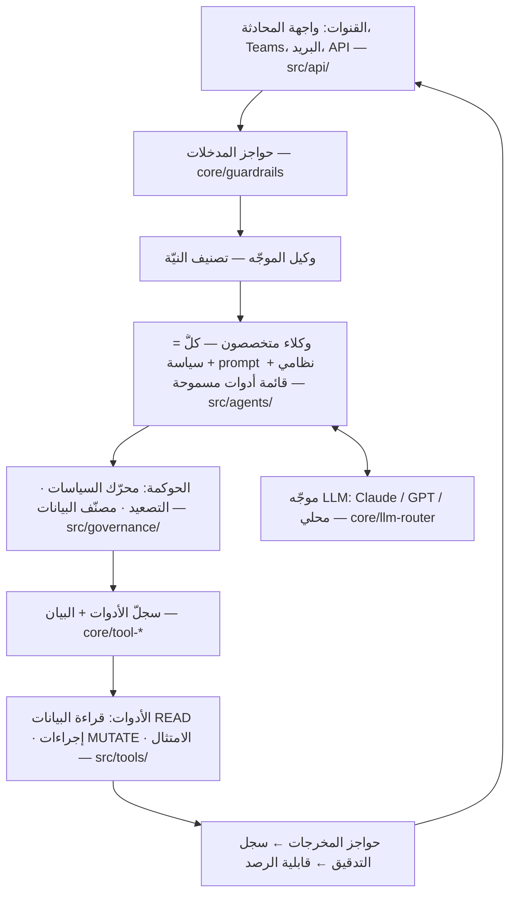
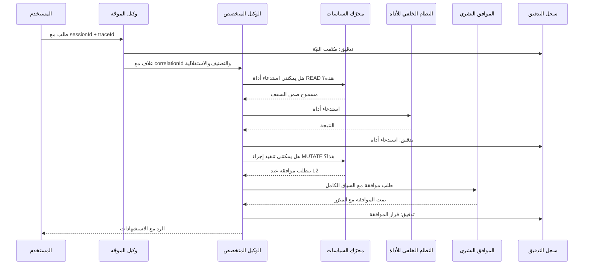
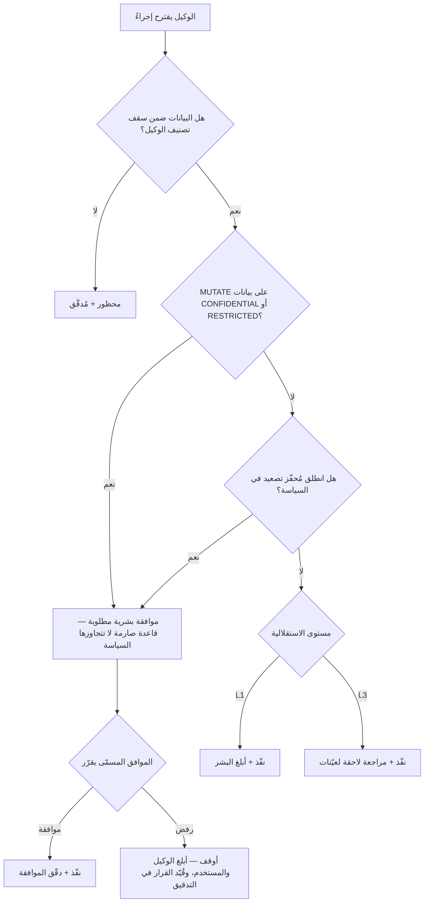
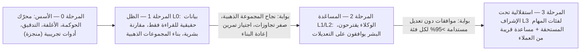

# تشغيل وكلاء الذكاء الاصطناعي في بيئة الإنتاج داخل بنك خاضع للتنظيم

**دليل تشغيل (playbook) لبنك قطر للتنمية (QDB): الوكلاء (agents) بوصفهم موظفين رقميين — كيف تبنيهم، وتؤمّنهم، وتربطهم، وتحكمهم، وتقيّمهم، وتضع لهم الحواجز الوقائية (guardrails)، وترصدهم، وتدير إصداراتهم.**

هذه الوثيقة هي دليل التشغيل الذي يقف خلف التنفيذ المرجعي `qdb-agent-framework` في هذا المستودع. يشرح كل قسم المبدأ، والممارسة المعتمدة في القطاع، وكيف يطبّقه الإطار اليوم (مع الإشارة إلى الملفات)، وما الذي بقي إنجازه قبل النشر الفعلي في بيئة الإنتاج (production deployment) ضمن بيئة خاضعة للتنظيم.

---

## 1. نموذج التشغيل: الوكلاء بوصفهم موظفين رقميين

الإطار الذي طرحه الرئيس التنفيذي — "الوكلاء (agents) بوصفهم موظفين/مستشارين" — هو النموذج الذهني الصحيح تمامًا لمؤسسة خاضعة للتنظيم، لأن كل ما يعرف البنك أصلًا كيف يفعله مع *الأشخاص* ينتقل إلى الوكلاء:

| مفهوم الموارد البشرية | ما يقابله لدى الوكيل | موقعه في هذا الإطار |
|---|---|---|
| الوصف الوظيفي | سياسة الوكيل (policy): النطاق، والمجالات، والأدوات المسموحة/الممنوعة | `policies/*.yaml` (`scope`, `allowed_tools`, `denied_tools`) |
| عقد العمل | سياسة ذات إصدار يعتمدها الفريق المالك (owner team) | الحقلان `owner_team` و`version` في YAML السياسة |
| بطاقة الدخول / حسابات الأنظمة | هوية غير بشرية بصلاحيات وفق مبدأ أقل صلاحية (least privilege) | `src/api/middleware/auth.ts` (يحتاج إلى هوية عبء العمل (workload identity) — انظر §3) |
| مصفوفة تفويض الصلاحيات | مستويات الاستقلالية (autonomy levels) (L0–L3) مع استثناءات لكل عملية | كتلة `autonomy` في السياسات؛ `src/governance/escalation.ts` |
| المدير المباشر | المالك البشري الذي يوافق على حالات التصعيد (escalation) | أدوار `escalation.rules[].notify` |
| فترة التجربة | وضع الظل ← الوضع المساعِد ← الاستقلالية تحت الإشراف | §10 خارطة طريق النضج |
| تقييم الأداء | حزمة تقييم (evaluation) مستمرة + لوحات مؤشرات الأداء الرئيسية (KPI) | §6 (أكبر فجوة حالية) |
| مدونة السلوك | الـprompt النظامي (system prompt) + الحواجز الوقائية (guardrails) | `system_prompt` في السياسة؛ `src/core/guardrails.ts` |
| سجل الدوام / سجل النشاط | أثر تدقيق (audit trail) غير قابل للتعديل لكل إجراء | `src/core/audit-logger.ts` |
| الإجراءات التأديبية | مفتاح الإيقاف (kill switch)، وإلغاء السياسة، والتراجع (rollback) | §9 |
| إنهاء الخدمة | إلغاء التسجيل، وإلغاء بيانات الاعتماد، وإتلاف السياق | `context_policy.clear_context_on_completion` |

**القرار التنظيمي الجوهري:** يجب أن يكون لكل وكيل مالك بشري مسمّى ("مدير الوكيل") يُساءل عن أفعاله، تمامًا كما يُساءل المدير عن مرؤوسه المباشر. الوكيل الذي لا مالك له هو تقنية معلومات ظلّية (shadow IT). الحقل `owner_team` في كل ملف سياسة يجعل ذلك إلزاميًا على مستوى المخطط (schema) (يرفض `src/governance/policy-engine.ts` أي سياسة لا تتضمنه).

**ما سيسأل عنه المنظّمون أولًا:** "من المسؤول عندما يخطئ الوكيل؟" يجب ألا تكون الإجابة أبدًا "النموذج". المسؤول دائمًا هو الفريق المالك، الذي يعمل ضمن إطار موثّق لتفويض الصلاحيات. الوكلاء لا يتحمّلون المساءلة؛ بل لديهم *مستويات صلاحية* مفوَّضة وقابلة للإلغاء.

---

## 2. البناء: البنية المرجعية

### 2.1 المبادئ

1. **وكلاء (agents) صغار ومتخصصون بدلًا من وكيل خارق واحد.** يحصل كل وكيل على وصف وظيفي ضيق (ملف سياسة (policy) واحد)، ما يجعل النطاق والاختبار والتدقيق أمورًا قابلة للإدارة. يصنّف وكيل الموجّه (router) (`src/agents/router/`) النيّة ثم يوزّع الطلبات — وهو نمط يعادل مكتب فرز في المكتب الأمامي.
2. **تنسيق (orchestration) حتمي يحيط بتفكير غير حتمي.** يقرّر الـLLM *ماذا يقول وأي أداة (tool) يطلب*؛ بينما تقرّر شيفرة حتمية *ما إذا كان مسموحًا له بذلك*. تطبيق السياسات والتصعيد (escalation) والتدقيق شيفرة عادية (`src/governance/`)، ولا تُفوَّض أبدًا إلى النموذج. في بيئة خاضعة للتنظيم هذا أمر غير قابل للتفاوض: لا يمكنك اعتماد prompt، لكن يمكنك اعتماد محرّك تطبيق.
3. **مسارات عمل قائمة على الرسوم البيانية (graph) للعمليات متعددة الخطوات** (`src/core/graph-engine.ts`): عُقد وحواف صريحة بدلًا من حلقات وكيل حرّة الشكل، بحيث يمكن حصر كل مسار عبر سير العمل — وهذا ما يحتاجه المدقّق.
4. **تجريد المزوّدين** (`src/core/llm-router.ts`): وجّه مهام التصنيف إلى نماذج سريعة/منخفضة التكلفة ومهام التفكير إلى النماذج المتقدمة (frontier models)، واحتفظ بخيار النماذج المحلية (Ollama) للبيانات التي يجب ألا تغادر الدولة. متطلبات إقامة البيانات (data residency) في قطر (PDPPL، وتوقعات QCB) تجعل الاستدلال المستضاف على Azure في قطر أو داخل مقرّ البنك (on-prem) هو الخيار الافتراضي للبيانات المصنّفة CONFIDENTIAL/RESTRICTED.
5. **عقود ذات أنواع محدّدة في كل مكان.** مخرجات منظَّمة مع تحقق من المخطط (`src/core/structured-output.ts`، ومخططات Zod في كل مكان) — لا تُقبل مخرجات الوكيل إلا إذا أمكن تحليلها. النص الحرّ الذي يربط بين الأنظمة هو الموضع الذي تتحوّل فيه الهلوسة (hallucinations) إلى حوادث (incidents).

### 2.2 الطبقات

كل قفزة تمرّ عبر وسيط: لا شيء ينتقل من النموذج إلى الأداة، أو من وكيل إلى وكيل، دون المرور بمحرّك السياسات وإصدار سجل تدقيق (audit record).

### 2.3 البناء مقابل الشراء

استخدم المنصّات المُدارة (Azure AI Foundry / AWS Bedrock Agents / Claude Agent SDK) لبيئة التشغيل حيثما أمكن، لكن **امتلك طبقة الحوكمة (governance) بنفسك**. يمنحك المورّدون وكلاء؛ لكنهم لا يمنحونك مصفوفة تفويض الصلاحيات الخاصة بك، ولا قواعد الفحص الشرعي، ولا التزامات الإبلاغ تجاه QCB. النمط المتّبع في هذا المستودع — وكلاء رفيعون وحوكمة سميكة — يصمد أمام أي انتقال بين المورّدين.

---

## 3. التأمين

نموذج التهديدات (threat model) للوكلاء (agents) = تهديدات أمن التطبيقات التقليدية **إضافةً إلى** ثلاث فئات جديدة: حقن الأوامر (prompt injection)، والصلاحية المفرطة (excessive agency)، وتسريب البيانات عبر سياق النموذج. المرجع: OWASP Top 10 for LLM Applications (LLM01 Prompt Injection، LLM06 Excessive Agency، LLM02 Sensitive Information Disclosure).

### 3.1 الهوية: الوكلاء هويات غير بشرية (NHI)

- يحصل كل وكيل على **هوية عبء عمل (workload identity) خاصة به** (Entra ID managed identity / service principal على Azure) — وليس أبدًا مفتاح API مشتركًا، ولا بيانات اعتماد شخص بشري. هوية الوكيل، لا هوية المستخدم المستدعي، هي ما تُجيزه الأنظمة الخلفية للأدوات (tools) — مقرونةً بصلاحيات *المستخدم* المُمرَّرة عبر الغلاف (envelope) (`metadata.userId`) بحيث لا يستطيع الوكيل أبدًا أن يفعل لمستخدم ما لا يستطيع المستخدم فعله بنفسه (منع مشكلة "النائب المُضلَّل" (confused deputy)).
- بيانات اعتماد قصيرة العمر فقط؛ الأسرار (secrets) في Key Vault؛ والتدوير مؤتمت.
- **فجوة في الإطار الحالي:** يتولى `src/api/middleware/auth.ts` مصادقة الـAPI الواردة، لكن الوكلاء لا يحملون بعد هويات صادرة مستقلة. قبل بيئة الإنتاج (production)، يجب مصادقة استدعاءات الأدوات (tool calls) لكل وكيل باسم ذلك الوكيل، كي تعمل مراجعة الصلاحيات لكل وكيل على حدة، مثل مراجعة الوصول لكل موظف.

### 3.2 أقل صلاحية عبر القوائم المسموحة للأدوات

هذه أكثر ضوابط الرقابة فاعلية على الإطلاق. لا يستطيع الوكيل فعليًا استدعاء أداة ليست في قائمته المسموحة (allowlist) — ويُفرض ذلك في الشيفرة لا في الـprompt:

- `allowed_tools` / `denied_tools` في كل سياسة (policy) (انظر `policies/it-operations.yaml`، الذي يمنع `qdb.data.query_core_banking` عن وكيل تقنية المعلومات).
- يحلّ سجلّ الأدوات (tool registry) (`src/core/tool-registry.ts`) الاستدعاءات فقط مقابل سياسة الوكيل؛ ويصرّح البيان (manifest) (`src/core/tool-manifest.ts`) بـ`operationType` لكل أداة (READ/MUTATE) وبأقصى تصنيف للبيانات مسموح به.
- تعامل مع قائمة الأدوات كأنها وثيقة مراجعة وصول: إعادة اعتماد ربع سنوية من الفريق المالك (owner team)، تمامًا مثل مراجعة وصول المستخدمين.

### 3.3 حدود تصنيف البيانات

يحمل كل غلاف رسالة `dataClassification` (PUBLIC → INTERNAL → CONFIDENTIAL → RESTRICTED)، وتصرّح كل سياسة بـ`data_boundaries.max_classification`. يوسم مصنّف البيانات (data classifier) (`src/governance/data-classifier.ts`) المحتوى؛ ويمنع محرّك السياسات الوكيل من التعامل مع بيانات تتجاوز مستوى تصريحه — وهو المفهوم نفسه للتصريح الأمني للموظف. تُعالَج البيانات الشخصية (PII) وفق السياسة (`pii_handling: MASK`).

### 3.4 الدفاع المتعدد الطبقات ضد حقن الأوامر

لا يوجد ضابط واحد يوقف الحقن؛ لذا ضع الضوابط في طبقات:

1. تطابق حواجز المدخلات أنماطَ علامات الحقن المعروفة (`src/core/guardrails.ts` `INJECTION_PATTERNS`) — طبقة ضرورية لكنها الأضعف.
2. **احتواء الصلاحيات هو الدفاع الحقيقي:** حتى الوكيل المُختطف بالكامل لا يستطيع إلا استدعاء أدواته المسموحة، ضمن تصريح بياناته، وتحت سقف استقلاليته. صمّم النظام بحيث تكون أسوأ تعليمات محقونة ممكنة *محدودة الأثر*، لا ممنوعة فحسب.
3. تعامل مع كل المحتوى المُسترجَع (مستندات من ECM، وصفحات الويب، ورسائل البريد) على أنه بيانات غير موثوقة، وليس تعليمات أبدًا؛ واحفظه في سياق محدّد الفواصل بوضوح.
4. عمليات MUTATE تتطلب دائمًا موافقة عند مستوى CONFIDENTIAL فما فوق (قاعدة صارمة في `src/governance/escalation.ts`)، فلا يستطيع الحقن التسبّب في تغيير غير مُراجَع للحالة على بيانات حساسة.

### 3.5 بقية قائمة التحقق

- تفحص حواجز المخرجات أي بيانات شخصية (PII) أو أسرار تغادر النظام (§7).
- تحديد المعدّل (rate limiting) لكل وكيل ولكل مستخدم (`src/api/middleware/rate-limit.ts`) — الوكيل الذي يدخل في حلقة يمثّل خطر "استنزاف المحفظة" (denial-of-wallet) وخطر إغراق.
- تنفيذ معزول (sandboxed) لأي أدوات تشغّل شيفرة (لا يوجد منها في هذا المستودع بعد — وأبقِ الأمر كذلك حتى يتوفر منفّذ معزول بالحاويات).
- اختبار اختراق لسطح الوكلاء: تمارين الفريق الأحمر (red team) مخصّصة لسلاسل الحقن ← التسريب، قبل الإطلاق وسنويًا. سيتوقع QCB ذلك ضمن الفئة نفسها لاختبار اختراق التطبيقات.

---

## 4. التواصل: وكيل ↔ وكيل ووكيل ↔ إنسان

### 4.1 من وكيل إلى وكيل

تستخدم كل حركة المرور بين الوكلاء (agents) غلافًا (envelope) واحدًا غير قابل للتعديل ومتحقَّقًا منه وفق المخطط (`src/core/message-envelope.ts`) عبر ناقل رسائل (message bus) (`src/core/message-bus.ts`). الغلاف هو العقد الذي يجعل الأنظمة متعددة الوكلاء (multi-agent) قابلة للتدقيق:

- `messageId` / `correlationId` / `parentMessageId` — إعادة بناء السلسلة السببية كاملة ("أي طلب مستخدم دفع هذا الوكيل إلى استدعاء تلك الأداة؟").
- `sourceAgent` / `targetAgent` / `action` / `payload` محدّد النوع — لا دردشة نصية حرّة بين الوكلاء.
- `dataClassification`، `requiresApproval`، `autonomyLevel` — بيانات الحوكمة (governance) الوصفية تنتقل **مع** الرسالة، فلا يستطيع وكيل لاحق في السلسلة أن "يغسل" بيانات مقيّدة بصمت أو أن يرفع مستوى الاستقلالية.
- `ttlSeconds` — تنتهي صلاحية الرسائل؛ فلا تُنفَّذ تعليمات قديمة بعد ساعات.

طلب كامل من البداية إلى النهاية — كل نقطة تماس مع الحوكمة وكل حدث تدقيق في صورة واحدة:

اتجاه القطاع: MCP (Model Context Protocol) لربط الوكيل←الأداة، وبروتوكولات على نمط A2A للربط وكيل←وكيل. نمط الغلاف هنا يتوافق بسلاسة مع كليهما — اعتمد MCP لتكامل الأدوات مع نضوج الموصلات (connectors) (الأنظمة المصرفية الأساسية وECM وPower BI لديها أصلًا أشكال أدوات تجريبية في `src/tools/data/`)، لكن أبقِ غلاف الحوكمة معيارك الداخلي: البروتوكولات المفتوحة تحمل الرسالة، وغلافك يحمل *سياق الصلاحية*.

### 4.2 من وكيل إلى إنسان: سلّم الاستقلالية

مُقنَّن بوصفه `AutonomyLevel` في `src/core/types.ts` ومُطبَّق عبر `src/governance/escalation.ts`:

| المستوى | المعنى | التشبيه |
|---|---|---|
| **L0_SHADOW** | ينتج الوكيل مخرجات؛ لا يُعرض/يُنفَّذ شيء. يقارن البشر لاحقًا. | متدرّب يرافق موظفًا |
| **L1_NOTIFY** | يتصرّف الوكيل في مهام القراءة فقط، ويُبلغ البشر بكل شيء | موظف جديد تحت الإشراف |
| **L2_APPROVE** | يقترح الوكيل؛ ويوافق إنسان مسمّى قبل التنفيذ | المُنشئ والمُراجع (مبدأ العيون الأربع) |
| **L3_AUTONOMOUS** | ينفّذ الوكيل ضمن السياسة؛ مع مراجعة عيّنات لاحقًا | صلاحية مفوَّضة مع تدقيق |

قواعد يجب أن تبقى مُثبَّتة في الشيفرة (وهي كذلك في `escalation.ts`):

- MUTATE + CONFIDENTIAL/RESTRICTED ← دائمًا L2 (موافقة بشرية)، بصرف النظر عن السياسة.
- لا يمكن لـ`overrides` في السياسة إلا *خفض* الاستقلالية لشرط معيّن، ولا يمكنها أبدًا رفعها فوق سقف السياسة.
- تذهب طلبات الموافقة إلى **أدوار مسمّاة** (`notify: ["it_manager", "cio"]`)، مع إرفاق الغلاف الكامل والتعليل — فالموافق الذي لا يرى *السبب* مجرد ختم مطاطي، وسيشير المدقّق إلى ذلك.
- تُسجَّل الموافقات بوصفها أحداث تدقيق من الدرجة الأولى (الموافق، والطابع الزمني، والقرار، والمبرّر).

كيف يُتخذ القرار بشأن كل إجراء مقترح، كما يُطبَّق في `escalation.ts`:

**تصميم الجانب البشري لا يقلّ أهمية عن تصميم جانب الوكيل:** إرهاق الموافقات هو نمط الفشل. إذا تلقّى دور ما مئات الموافقات يوميًا، يتوقف البشر عن قراءتها. تتبّع حجم الموافقات ومعدّل التجاوز لكل دور؛ فإذا كانت >95% من الطلبات تُعتمد دون تعديل لفئة مهام معيّنة على مدى فترة مستدامة، فهذه هي الحجة المبنية على البيانات لترقية تلك الفئة إلى L3 — عبر إدارة التغيير (§9)، لا بتعديل prompt.

### 4.3 التحدث مع المستخدمين النهائيين

- يعرّف الوكلاء أنفسهم بأنهم وكلاء. لا انتحال لصفة البشر — وهذا متطلب قانوني/تنظيمي في عدد متزايد من الولايات القضائية، وقاعدة أساسية للثقة في كل مكان.
- ردود متدفقة (streaming) (`src/core/streaming.ts`) مع حالة مرئية ("جارٍ فحص Azure Monitor…") ليفهم المستخدمون ما يفعله الوكيل.
- كل إجابة موجّهة للمستخدم تعتمد على بيانات داخلية تستشهد بمصادرها (الأداة + السجل)، ليتمكن الإنسان من التحقق. الادعاءات غير الموثّقة هي الطريق الذي تدخل منه الهلوسة (hallucinations) إلى السجلات الرسمية.

---

## 5. الحوكمة

### 5.1 المواءمة التنظيمية لبنك قطر للتنمية

| النظام التنظيمي | ما يتطلبه من الوكلاء | نقطة الربط في الإطار |
|---|---|---|
| **لوائح QCB وإرشاداته** (بما فيها إرشاداته للذكاء الاصطناعي في القطاع المالي) | إطار حوكمة (governance) للذكاء الاصطناعي معتمد من مجلس الإدارة، وسجلّ للنماذج، وإشراف بشري، وقابلية التفسير (explainability)، واستراتيجية خروج لكل نظام | سجلّ السياسات = السجلّ الحصري؛ سلّم الاستقلالية = الإشراف؛ أثر التدقيق (audit trail) = دليل قابلية التفسير |
| **قانون PDPPL القطري (القانون 13/2016)** | أساس قانوني، وتقليل البيانات، وأمن البيانات الشخصية، وضوابط النقل عبر الحدود | مصنّف البيانات + `pii_handling` + توجيه LLM مراعٍ لإقامة البيانات (data residency) |
| **سياسة NCSA / NIA** | ضوابط ضمان المعلومات الوطنية، والإبلاغ عن الحوادث | قابلية الرصد (observability) + التدقيق + أدلة الاستجابة للحوادث (incident runbooks) |
| **الحوكمة الشرعية (Sharia governance)** (لمنتجات التمويل الإسلامي) | فحص التوصيات للتحقق من امتثالها للشريعة | `src/tools/compliance/check-sharia.ts`؛ وتراجع هيئة الرقابة الشرعية سياسات الوكلاء التي تمسّ قرارات المنتجات |
| **إدارة مخاطر النماذج (model risk management)** (على نمط بازل، وSR 11-7 بوصفه المرجع العالمي) | سجلّ النماذج، والتحقق المستقل (independent validation)، والمراقبة المستمرة، والقيود الموثّقة | يوفّر التقييم في §6 وإدارة الإصدارات في §9 الوثائق اللازمة |
| **EU AI Act (بوصفه معيارًا دوليًا)** | ذكاء اصطناعي لقرارات الائتمان = عالي المخاطر: نظام لإدارة المخاطر، وحوكمة البيانات، والتسجيل، والإشراف البشري، والدقة/المتانة، و**العدالة/عدم التمييز (fairness/non-discrimination)**، والتوثيق الفني | يتوافق بشكل وثيق مع مجموعة ضوابط الأنظمة عالية المخاطر — ولا تزال عدة ضوابط فجوات (الهوية الصادرة للوكيل §3.1، والتقييمات §6، واكتشاف PII بمستوى DLP §7.3، واختبار العدالة) |

بنك قطر للتنمية بنك تنموي، وليس بنكًا تجاريًا يتلقى الودائع، لكن إشراف QCB وقانون PDPPL لا يزالان ساريين، واعتماد مجموعة ضوابط الذكاء الاصطناعي عالي المخاطر يضع QDB متقدّمًا على الاتجاه الذي يسير نحوه التنظيم الإقليمي بوضوح.

### 5.2 الهيكل التشغيلي للحوكمة

1. **لجنة حوكمة الذكاء الاصطناعي** (بتمثيل من CIO/COO/CRO/الامتثال/الشرعية): تعتمد كل وكيل (agent) جديد، وكل ترقية للاستقلالية، وكل تغيير جوهري في السياسة (policy). تجتمع شهريًا؛ مع مسار طوارئ لقرارات مفتاح الإيقاف (kill switch).
2. **الفرق المالكة للوكلاء (owner teams)**: المساءلة اليومية، وموافقات خط الدفاع الأول، وصيانة السياسات. تُسمّى في كل ملف سياسة.
3. **التحقق المستقل** (وظيفة المخاطر): يقيّم الوكلاء قبل النشر (deployment) وبصورة دورية بعده — ويجب أن يكون منفصلًا تنظيميًا عن فريق البناء، تمامًا مثل الفصل بين التحقق من النماذج وتطوير النماذج في مخاطر الائتمان.
4. **ملف السياسة هو وثيقة الحوكمة.** كل ما تعتمده اللجنة يمكن التعبير عنه في YAML: النطاق، والأدوات، والاستقلالية، والتصعيد، وحدود البيانات، وعمر السياق. سجلّ Git لـ`policies/` *هو* سجلّ الاعتماد عند اقترانه بالفروع المحمية + المراجعات الإلزامية (§9).

### 5.3 الأسئلة الثلاثة التي يجب أن يجيب عنها كل نشر لوكيل كتابةً

1. **ما أسوأ ما يمكن أن يفعله هذا الوكيل إذا اختُرق بالكامل؟** (تحليل نطاق الضرر المحدود — أدواته × تصريح بياناته × سقف استقلاليته)
2. **من يراجع عمله، وكم مرة، ووفق أي معيار؟**
3. **كيف نوقفه، وماذا يحدث للعمل الجاري عندما نفعل ذلك؟**

---

## 6. التقييم

**هذه أكبر فجوة بين الإطار الحالي والجاهزية لبيئة الإنتاج (production).** يضم المستودع حزمة اختبارات حتمية كبيرة تغطي الآليات *الحتمية* (تطبيق السياسات، والتحقق من الأغلفة، واكتمال التدقيق، والحواجز الوقائية (guardrails) في مواجهة الهجمات — `tests/governance/`، `tests/unit/`)، وهي الأساس الصحيح، لكن الوكلاء (agents) في بيئة الإنتاج يحتاجون أيضًا إلى تقييم (evaluation) السلوك *غير الحتمي*.

### 6.1 منظومة التقييم (ابنِها بهذا الترتيب)

1. **مجموعات بيانات ذهبية (golden datasets) لكل وكيل.** من 50 إلى 200 مثال مهام حقيقي (مُجهّل الهوية) لكل وكيل مع النتائج المتوقعة، يعدّها الفريق المالك (owner team) ويحدّثها كل ربع سنة. بالنسبة للموجّه (router): النيّة ← الوكيل الهدف الصحيح. بالنسبة لعمليات تقنية المعلومات: نص الحادثة ← درجة الخطورة الصحيحة + دليل التشغيل الصحيح. هذه هي "أهداف الأداء" للوكيل.
2. **التأكيدات الحتمية أولًا.** هل استدعى أداة (tool) مسموحة؟ هل أمكن تحليل المخرجات وفق المخطط؟ هل صعّد عندما تطلّب السيناريو ذلك؟ هل رفض الطلبات الخارجة عن النطاق؟ هذه فحوص رخيصة وموضوعية، وتغطي السلوكيات الحرجة للامتثال. وسّع حزم vitest الحالية — أداة المحاكاة (`scripts/simulate-workflow.ts`) هي المكان الطبيعي لإعادة تشغيل السيناريوهات الذهبية.
3. **استخدام LLM حَكَمًا (LLM-as-judge) لأبعاد الجودة** (الدقة، والاستناد إلى البيانات المسترجَعة، والنبرة) — مفيد لكنه لا يكون أبدًا البوابة (gate) *الوحيدة* لقرار خاضع للتنظيم؛ فالحكّام أنفسهم نماذج ويتعرضون للانحراف. عايِر الحَكَم مقابل عيّنة من تقييمات بشرية كل ربع سنة.
4. **التقييم البشري على العيّنات.** في مرحلتي L0/L1، يقيّم البشر أسبوعيًا عيّنة ذات دلالة إحصائية؛ وهذا يمثّل في الوقت نفسه ملف الأدلة لترقية الاستقلالية.
5. **التقييم العدائي.** حزمة دائمة للفريق الأحمر (red team): محاولات الحقن، والطلبات الخارجة عن النطاق، ومحاولات استخراج PII، وطلبات منتجات غير متوافقة مع الشريعة. يجب أن *يفشل الوكيل بأمان* فيها جميعًا، وتُشغَّل هذه الحزمة عند كل تغيير.

### 6.2 متى تُشغَّل التقييمات

- **قبل الدمج (CI):** الحزمة الحتمية كاملة + اختبار الانحدار على المجموعة الذهبية عند كل تغيير في الـprompts أو السياسات أو الأدوات أو إصدار النموذج. تعديل الـprompt تغيير في الشيفرة؛ ولا يُطلق دون اجتياز التقييمات (evals).
- **قبل الترقية:** يشغّل التحقق المستقل (independent validation) المنظومة كاملة، بما فيها التقييم العدائي، قبل أي رفع لمستوى الاستقلالية.
- **باستمرار في بيئة الإنتاج:** أدخِل عيّنات من الحركة الحية (مع غطاء من الموافقة/السياسة) إلى خط التقييم؛ وراقب الانحراف في معدّل التصعيد، ومعدّل أخطاء الأدوات، ومعدّل التجاوز، ودرجات الحَكَم. مزوّدو النماذج يحدّثون نماذجهم؛ وتقييماتك هي الطريقة التي تلاحظ بها ذلك.

### 6.3 مؤشرات الأداء الرئيسية لكل وكيل ("تقييم الأداء")

معدّل نجاح المهام، ومعدّل التصعيد، ومعدّل التجاوز البشري (الموافقات المعدّلة/المرفوضة)، ومعدّل انتهاك الحواجز الوقائية، وزمن الاستجابة (latency)، والتكلفة لكل مهمة (cost per task)، و— الأهم لسردية "الوكلاء بوصفهم موظفين" — *فروق زمن الدورة والجودة مقارنةً بخط الأساس السابق للوكلاء*. تُرفع التقارير إلى لجنة الحوكمة شهريًا.

---

## 7. الحواجز الوقائية

الحواجز الوقائية (guardrails) هي طبقة التطبيق وقت التشغيل التي تعمل على **كل** مُدخل ومُخرج، بمعزل عمّا يريد النموذج فعله (`src/core/guardrails.ts`).

### 7.1 أسطح الحواجز الوقائية الأربعة

1. **حواجز المدخلات** (قبل أن يرى الـLLM أي شيء): حظر أنماط الحقن، ومرشّحات الموضوع/النطاق، وحدود حجم المدخلات، ووسم التصنيف.
2. **حواجز المخرجات** (قبل أن يغادر أي شيء): اكتشاف PII/الأسرار وإخفاؤها، والمحتوى المسيء، والادعاءات غير الموثّقة في الإجابات المستندة إلى البيانات، والتحقق من المخطط.
3. **حواجز استدعاء الأدوات (tool call)** (قبل التنفيذ): محرّك السياسات (policy) — القائمة المسموحة، وسقف التصنيف، وقواعد نوع العملية، وفحص الاستقلالية. هنا تلتقي الحواجز الوقائية بالحوكمة (governance)؛ وهو أقوى الأسطح لأنه يضبط *الأفعال*، لا الكلمات فقط.
4. **الحدود السلوكية:** الحد الأقصى للأدوار لكل مهمة، والحد الأقصى لاستدعاءات الأدوات لكل مهمة، وميزانية الـtokens/التكلفة لكل جلسة، ومدة صلاحية الجلسة (`context_policy` في كل سياسة). الحلقة الجامحة تصطدم بجدار صلب، لا باقتراح لطيف في الـprompt.

### 7.2 نموذج الخطورة

`BLOCK` / `WARN` / `INFO` (كما هو مُنفَّذ): BLOCK يوقف الإجراء ويدقّقه؛ وWARN يُكمل ويدقّق؛ وINFO يدقّق بصمت. إرشادات الضبط: ابدأ صارمًا (حظر زائد)، ثم خفّف بناءً على مراجعة الإيجابيات الكاذبة — أما الاتجاه المعاكس (البدء بتساهل ثم التشديد بعد حادثة) فهو الطريق الذي يوصل البنوك إلى عناوين الأخبار.

### 7.3 ما يجب إضافته قبل بيئة الإنتاج

- استبدل اكتشاف PII القائم على التعابير النمطية (regex) فقط بكاشف مناسب (مثل Presidio أو API لمنع تسرّب البيانات (DLP) سحابي) — فالتعابير النمطية تغفل الأسماء المكتوبة بالحروف العربية، وأرقام البطاقات الشخصية القطرية (QID) الواردة في النصوص، وصيغ IBAN المختلفة.
- مصنّفات لحقن الأوامر (prompt injection) (قائمة على النماذج) إلى جانب قائمة الأنماط.
- تسجيل قرارات الحواجز الوقائية في سجل التدقيق (audit log) مع السياق الكامل كي تكون الإيجابيات الكاذبة قابلة للمراجعة (موجود جزئيًا — تأكّد من أن كل BLOCK يكتب حدث تدقيق).

---

## 8. الرصد

قاعدة عملية من تعلّم الآلة في البيئات الخاضعة للتنظيم: **إن لم تستطع إعادة بنائه، فأنت لم تحكمه.** نظامان متمايزان، كلاهما موجود بصورة هيكلية أولية:

### 8.1 أثر التدقيق (سجل الامتثال)

`src/core/audit-logger.ts` — كل استدعاء أداة، وتصعيد، وموافقة، وانتهاك للحواجز الوقائية (guardrails)، وقرار سياسة (policy) يصبح حدث تدقيق غير قابل للتعديل مرتبطًا بـ`traceId`/`correlationId`. متطلبات بيئة الإنتاج (production):

- **تخزين يقبل الإضافة فقط ويكشف العبث** (تخزين WORM / جدول دفتر أستاذ)، يُحتفظ به وفق متطلبات حفظ السجلات لدى QCB (بما يتوافق مع سياسة البنك الحالية للاحتفاظ بالمستندات لمدة 10 سنوات).
- يجب أن يسجّل: من (المستخدم + هوية الوكيل (agent))، وماذا (الإجراء + مراجع الحمولة الكاملة للمدخلات/المخرجات)، ومتى، وتحت أي **إصدار** من السياسة، وبأي **إصدار** من النموذج، ومن الإنسان الذي وافق.
- قابل للاستعلام حسب الحالة: "اعرض لي كل ما حدث للارتباط X" — `src/api/routes/audit.ts` هو بداية ذلك؛ وسّعه ليصبح ضمن أدوات فريق الامتثال.

### 8.2 القياس التشغيلي عن بُعد

`src/core/observability.ts` — تتبّعات (traces) ومقاييس OpenTelemetry على كل إجراء للوكيل، مع span لكل استدعاء أداة، قابلة للتصدير إلى Azure Monitor / Datadog / Jaeger. إضافات بيئة الإنتاج:

- **لوحات معلومات لكل وكيل**: حجم الطلبات، والمئينات لزمن الاستجابة (latency)، ومعدّلات الأخطاء، وإنفاق الـtokens، ومعدّلات التصعيد والتجاوز.
- **التنبيه على الشذوذ السلوكي**، لا على الأخطاء فقط: قفزة مفاجئة في حالات BLOCK من الحواجز الوقائية (هجوم أو تراجع في الجودة)، وقفزة في حالات التصعيد (انجراف النطاق)، وانخفاض في نجاح المهام، وشذوذ في التكلفة (حلقة). وجّهها إلى الفريق المالك كأي خدمة في بيئة الإنتاج — فالوكلاء أنظمة قابلة للمناوبة.
- **تتبّعات خاصة بالـLLM**: سجّل الـprompt/الإكمال (مع إخفاء PII) لكل span، ليتمكن المهندس من إعادة تشغيل ما رآه النموذج بالضبط. وهذا أيضًا مصدرك لاستخراج بيانات التقييم.

### 8.3 اختبار إعادة البناء

تمرين ربع سنوي: اختر مهمة عشوائية من بيئة الإنتاج واطلب من الفريق أن يُنتج، من السجلات وحدها: طلب المستخدم، وكل قفزة بين الوكلاء، وكل استدعاء أداة بمدخلاته/مخرجاته، وكل قرار سياسة، وإصدارات النموذج + الـprompt + السياسة المعنية، والموافقات البشرية. إذا استغرقت إعادة البناء أكثر من ساعة، فهناك فجوة في قابلية الرصد (observability). وهذا التمرين هو بالضبط ما يبدو عليه التفتيش الميداني من الجهة التنظيمية.

---

## 9. إدارة الإصدارات والتغيير

سلوك الوكيل (agent) هو حاصل **خمس وثائق تُدار إصداراتها بشكل مستقل** — وأي تغيير في أي منها هو تغيير في الوكيل:

| الوثيقة | آلية إدارة الإصدارات | الحالة الراهنة |
|---|---|---|
| السياسة (policy) (النطاق، والأدوات، والاستقلالية) | Semver في YAML (`version: "1.0.0"`، يفرضه المخطط) + سجلّ Git | ✅ مُنفَّذ |
| الـprompt النظامي (system prompt) | موجود داخل ملف السياسة ← إدارة الإصدارات نفسها | ✅ مُنفَّذ |
| الأدوات (tools) | مدخلات البيان مع الإصدارات؛ واختبارات عقود لكل أداة | جزئي (`tool-manifest.ts`) |
| النموذج | معرّفات نماذج مثبّتة في موجّه LLM — لا "latest" أبدًا في بيئة الإنتاج (production) | ⚠️ ثبّت صراحةً لكل وكيل |
| الشيفرة (بيئة التشغيل، والحواجز الوقائية، والحوكمة) | دورة حياة تطوير البرمجيات (SDLC) العادية: Git، وCI، والإصدارات | ✅ مُنفَّذ |

### 9.1 قواعد ضبط التغيير

- `policies/` على فرع محمي: تتطلب التغييرات مراجعة الفريق المالك (owner team) **إضافةً إلى** اعتماد الحوكمة (governance) (لتغييرات الاستقلالية أو قائمة الأدوات). وبذلك يصبح سجلّ Git في الوقت نفسه سجلّ التغيير المقدّم للجهة التنظيمية.
- **تُعامَل ترقيات النماذج مثل ترقيات أنظمة المورّدين:** شغّل حزمة التقييم (evaluation) كاملة (§6) على إصدار النموذج الجديد في وضع الظل، وقارن مؤشرات الأداء الرئيسية، واحصل على الاعتماد، ثم انتقل مع جاهزية التراجع (rollback). لا تُرقِّ تلقائيًا أبدًا وكيلًا يحمل صلاحية L2 فما فوق.
- يسجّل كل حدث تدقيق إصدار السياسة + معرّف النموذج الساريين في حينه (أضف هذه الحقول إلى حدث التدقيق إن لم تكن موجودة) — وإلا فلن يمكن تفسير القرارات التاريخية بعد الترقية.
- **التراجع عملية من الدرجة الأولى:** إصدار السياسة السابق + تثبيت النموذج السابق، قابلان للنشر خلال دقائق. تدرّب عليه.

### 9.2 مفتاح الإيقاف

ثلاثة مستويات لمفتاح الإيقاف (kill switch)، كلها مبنية مسبقًا ومُتدرَّب عليها:

1. **تعطيل وكيل بعينه** — إلغاء تسجيله من الموجّه؛ وتُحال المهام الجارية إلى البشر (مسار الإدارة موجود: `src/api/routes/admin.ts`).
2. **خفض الاستقلالية** — إنزال أي وكيل إلى L1/L0 فورًا دون تعطيله (علامة إعداد، دون نشر).
3. **الإيقاف الشامل** — كل الوكلاء إلى L0، وإيقاف ناقل الرسائل مؤقتًا. هذا هو الزر الذي تملكه لجنة الحوكمة.

---

## 10. خارطة طريق النضج (كيف تطرح هذا فعليًا)

**المرحلة 0 — الأسس (أُنجزت في هذا المستودع):** محرّك الحوكمة (governance)، والأغلفة، والتدقيق، والحواجز الوقائية (guardrails)، ووكيلان (agents) داخليان (عمليات تقنية المعلومات، ومكتب إدارة المشاريع PMO) يعملان مع أدوات تجريبية.

**المرحلة 1 — الظل (L0)، المجالات الداخلية، نحو 3 أشهر:** اربط مصادر بيانات حقيقية للقراءة فقط (Azure Monitor، وECM، وPower BI) بهويات مستقلة لكل وكيل (§3.1)؛ ينتج الوكلاء مخرجات يقارنها البشر بعملهم؛ ابنِ مجموعات البيانات الذهبية من هذه المقارنات؛ وأطلق لوحات المعلومات. *بوابة (gate) النجاح:* نجاح المهام ≥ المستهدف على المجموعة الذهبية (golden set)؛ صفر حالات تجاوز لحظر BLOCK من الحواجز الوقائية؛ اجتياز تمرين إعادة البناء.

**المرحلة 2 — المساعَدة (L1/L2)، العمليات الداخلية:** يجيب الوكلاء ويقترحون؛ ويوافق البشر على التعديلات. فرز تذاكر تقنية المعلومات، وتقارير حالة PMO، واستعلامات المعرفة الداخلية. تتبّع معدّلات التجاوز بوصفها قاعدة الأدلة للترقية. هنا تظهر قيمة "المستشار الرقمي" أولًا، وهنا تتعلم المؤسسة كيف *تدير* الوكلاء.

**المرحلة 3 — الاستقلالية تحت الإشراف (L3) للفئات منخفضة المخاطر + أول استخدام قريب من العملاء:** رقِّ فئات مهام محددة ذات معدّلات موافقة دون تعديل مستدامة >95%؛ وأدخِل المساعدة الموجّهة للعملاء (لا *قرارات* موجّهة للعملاء أبدًا) مع الإفصاح. يبقى دعم تقييم الائتمان (`policies/credit-assessment.yaml`) دعمًا للقرار فقط: يجمع الوكيل المعلومات، ويتحقق من القيود الشرعية/قيود QCB (`src/tools/compliance/`)، ويُعدّ المسودات — ويقرّر موظف ائتمان بشري. في معظم الأنظمة التنظيمية (ووفق معيار EU AI Act) تُعدّ قرارات الائتمان المؤتمتة الفئة الأعلى خطورة؛ أبقِ البشر أصحاب القرار إلى أجل غير مسمّى ما لم تقرّر لجنة الحوكمة والتواصل مع الجهة التنظيمية خلاف ذلك.

كل ترقية = حزمة أدلة (نتائج التقييم، وتاريخ مؤشرات الأداء الرئيسية، وسجلّ الحوادث) ← التحقق المستقل (independent validation) ← اعتماد لجنة الحوكمة. الاستقلالية تُكتسب لكل فئة مهام، ولا تُمنح لكل وكيل.

---

## 11. قائمة التحقق من الجاهزية لبيئة الإنتاج (مختصرة)

**قبل أي بيانات حقيقية:** هويات عبء عمل (workload identities) لكل وكيل (agent) · الأسرار (secrets) في الخزنة · اكتشاف PII بمستوى DLP · فرض التوجيه وفق إقامة البيانات (data residency) · اختبار اختراق يشمل فريقًا أحمر (red team) لحقن الأوامر (prompt injection).

**قبل L2:** تجربة مستخدم للموافقة مع السياق الكامل · أحداث تدقيق للموافقات · حزمة تقييم (evaluation) في CI مع مجموعات بيانات ذهبية · لوحات معلومات + تنبيهات الشذوذ · تدريب على مفتاح الإيقاف (kill switch) · حماية فرع السياسات + مسار اعتماد الحوكمة (governance).

**قبل L3:** تقرير التحقق المستقل (independent validation) · أدلة مستدامة على معدّل التجاوز · نجاح الحزمة العدائية عبر إصدارين أو أكثر من النماذج · تمرين إعادة البناء في أقل من ساعة · اعتماد إطار حوكمة الذكاء الاصطناعي على مستوى مجلس الإدارة (توقّع من QCB).

---

*تُحدَّث هذه الوثيقة جنبًا إلى جنب مع الإطار. التغييرات على دليل التشغيل هذا التي تعدّل متطلبات الحوكمة تتبع مسار المراجعة نفسه المتّبع للتغييرات على `policies/`.*
