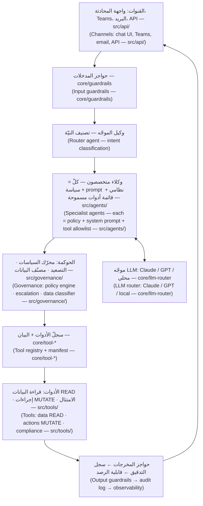
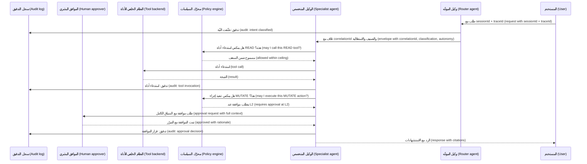
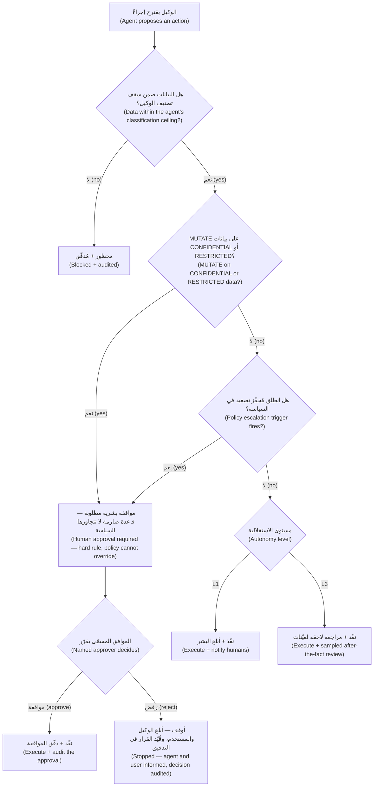
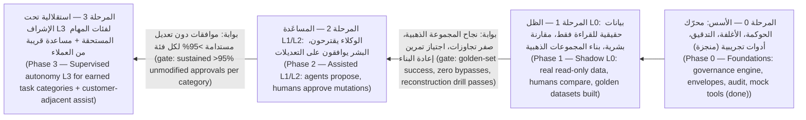

# تشغيل وكلاء (agents) الذكاء الاصطناعي (AI) في بيئة الإنتاج (production) داخل بنك خاضع للتنظيم (regulated bank)

**دليل تشغيل (playbook) لبنك قطر للتنمية (QDB): الوكلاء (agents) بوصفهم موظفين رقميين (digital employees) — كيف تبنيهم، وتؤمّنهم، وتربطهم، وتحكمهم، وتقيّمهم، وتضع لهم الحواجز الوقائية (guardrails)، وترصدهم، وتدير إصداراتهم.**

هذه الوثيقة هي دليل التشغيل (playbook) الذي يقف خلف التنفيذ المرجعي (reference implementation) `qdb-agent-framework` في هذا المستودع (repo). يشرح كل قسم المبدأ، والممارسة المعتمدة في القطاع (industry-standard practice)، وكيف يطبّقه الإطار (framework) اليوم (مع الإشارة إلى الملفات)، وما الذي بقي إنجازه قبل النشر الفعلي في بيئة الإنتاج (production deployment) ضمن بيئة خاضعة للتنظيم (regulated environment).

---

## 1. نموذج التشغيل (operating model): الوكلاء (agents) بوصفهم موظفين رقميين (digital employees)

الإطار الذي طرحه الرئيس التنفيذي (the CEO's framing) — "الوكلاء (agents) بوصفهم موظفين/مستشارين" — هو النموذج الذهني (mental model) الصحيح تمامًا لمؤسسة خاضعة للتنظيم (regulated institution)، لأن كل ما يعرف البنك أصلًا كيف يفعله مع *الأشخاص* ينتقل إلى الوكلاء:

| مفهوم الموارد البشرية (HR concept) | ما يقابله لدى الوكيل (agent equivalent) | موقعه في هذا الإطار (framework) |
|---|---|---|
| الوصف الوظيفي (job description) | سياسة الوكيل (policy): النطاق، والمجالات، والأدوات المسموحة/الممنوعة (allowed/denied tools) | `policies/*.yaml` (`scope`, `allowed_tools`, `denied_tools`) |
| عقد العمل (employment contract) | سياسة ذات إصدار (versioned policy) يعتمدها الفريق المالك (owner team) | الحقلان `owner_team` و`version` في YAML السياسة (policy) |
| بطاقة الدخول (access badge) / حسابات الأنظمة (system accounts) | هوية غير بشرية (non-human identity) بصلاحيات وفق مبدأ أقل صلاحية (least privilege) | `src/api/middleware/auth.ts` (يحتاج إلى هوية عبء العمل (workload identity) — انظر §3) |
| مصفوفة تفويض الصلاحيات (delegation of authority matrix) | مستويات الاستقلالية (autonomy levels) (L0–L3) مع استثناءات لكل عملية (with overrides per operation) | كتلة `autonomy` في السياسات (policies)؛ `src/governance/escalation.ts` |
| المدير المباشر (line manager) | المالك البشري (human owner) الذي يوافق على حالات التصعيد (escalation) | أدوار `escalation.rules[].notify` |
| فترة التجربة (probation period) | وضع الظل (shadow mode) ← الوضع المساعِد (assisted mode) ← الاستقلالية تحت الإشراف (supervised autonomy) | §10 خارطة طريق النضج (maturity roadmap) |
| تقييم الأداء (performance review) | حزمة تقييم (evaluation) مستمرة + لوحات مؤشرات الأداء الرئيسية (KPI) | §6 (أكبر فجوة حالية) |
| مدونة السلوك (code of conduct) | الـprompt النظامي (system prompt) + الحواجز الوقائية (guardrails) | `system_prompt` في السياسة (policy)؛ `src/core/guardrails.ts` |
| سجل الدوام (timesheet) / سجل النشاط (activity log) | أثر تدقيق (audit trail) غير قابل للتعديل لكل إجراء | `src/core/audit-logger.ts` |
| الإجراءات التأديبية (disciplinary process) | مفتاح الإيقاف (kill switch)، وإلغاء السياسة (policy revocation)، والتراجع (rollback) | §9 |
| إنهاء الخدمة (offboarding) | إلغاء التسجيل (deregistration)، وإلغاء بيانات الاعتماد (credential revocation)، وإتلاف السياق (context destruction) | `context_policy.clear_context_on_completion` |

**القرار التنظيمي الجوهري (key organizational decision):** يجب أن يكون لكل وكيل مالك بشري مسمّى ("مدير الوكيل (agent manager)") يُساءل عن أفعاله، تمامًا كما يُساءل المدير (manager) عن مرؤوسه المباشر (direct report). الوكيل (agent) الذي لا مالك له هو تقنية معلومات ظلّية (shadow IT). الحقل `owner_team` في كل ملف سياسة (policy file) يجعل ذلك إلزاميًا على مستوى المخطط (schema) (يرفض `src/governance/policy-engine.ts` أي سياسة (policy) لا تتضمنه).

**ما سيسأل عنه المنظّمون (regulators) أولًا:** "من المسؤول عندما يخطئ الوكيل (agent)؟" يجب ألا تكون الإجابة أبدًا "النموذج (model)". المسؤول دائمًا هو الفريق المالك (owner team)، الذي يعمل ضمن إطار موثّق لتفويض الصلاحيات (documented delegation-of-authority framework). الوكلاء (agents) لا يتحمّلون المساءلة (accountability)؛ بل لديهم *مستويات صلاحية (authority levels)* مفوَّضة وقابلة للإلغاء.

---

## 2. البناء: البنية المرجعية (reference architecture)

### 2.1 المبادئ (principles)

1. **وكلاء (agents) صغار ومتخصصون بدلًا من وكيل خارق (super-agent) واحد.** يحصل كل وكيل (agent) على وصف وظيفي ضيق (ملف سياسة (policy) واحد)، ما يجعل النطاق والاختبار والتدقيق (audit) أمورًا قابلة للإدارة. يصنّف وكيل الموجّه (router) (`src/agents/router/`) النيّة ثم يوزّع الطلبات — وهو نمط (pattern) يعادل مكتب فرز (triage desk) في المكتب الأمامي (front office).
2. **تنسيق (orchestration) حتمي (deterministic) يحيط بتفكير غير حتمي (non-deterministic reasoning).** يقرّر الـLLM *ماذا يقول وأي أداة (tool) يطلب*؛ بينما تقرّر شيفرة (code) حتمية *ما إذا كان مسموحًا له بذلك*. تطبيق السياسات (policy enforcement) والتصعيد (escalation) والتدقيق (audit) شيفرة عادية (`src/governance/`)، ولا تُفوَّض أبدًا إلى النموذج (model). في بيئة خاضعة للتنظيم (regulated environment) هذا أمر غير قابل للتفاوض (non-negotiable): لا يمكنك اعتماد prompt، لكن يمكنك اعتماد محرّك تطبيق (enforcement engine).
3. **مسارات عمل قائمة على الرسوم البيانية (graph) للعمليات متعددة الخطوات (multi-step processes)** (`src/core/graph-engine.ts`): عُقد وحواف صريحة (explicit nodes and edges) بدلًا من حلقات وكيل حرّة الشكل (free-form agent loops)، بحيث يمكن حصر كل مسار عبر سير العمل (workflow) — وهذا ما يحتاجه المدقّق (auditor).
4. **تجريد المزوّدين (provider abstraction)** (`src/core/llm-router.ts`): وجّه مهام التصنيف (classification tasks) إلى نماذج سريعة/منخفضة التكلفة (fast/cheap models) ومهام التفكير (reasoning tasks) إلى النماذج المتقدمة (frontier models)، واحتفظ بخيار النماذج المحلية (Ollama) للبيانات التي يجب ألا تغادر الدولة. متطلبات إقامة البيانات (data residency) في قطر (PDPPL، وتوقعات QCB) تجعل الاستدلال (reasoning) المستضاف على Azure في قطر أو داخل مقرّ البنك (on-prem) هو الخيار الافتراضي للبيانات المصنّفة CONFIDENTIAL/RESTRICTED.
5. **عقود ذات أنواع محدّدة (typed contracts) في كل مكان.** مخرجات منظَّمة (structured output) مع تحقق من المخطط (`src/core/structured-output.ts`، ومخططات Zod (Zod schemas) في كل مكان) — لا تُقبل مخرجات الوكيل (agent output) إلا إذا أمكن تحليلها. النص الحرّ (free text) الذي يربط بين الأنظمة هو الموضع الذي تتحوّل فيه الهلوسة (hallucinations) إلى حوادث (incidents).

### 2.2 الطبقات (layers)

```mermaid
flowchart TB
    CH["القنوات: واجهة المحادثة، Teams، البريد، API — src/api/<br/>(Channels: chat UI, Teams, email, API — src/api/)"]
    GI["حواجز المدخلات — core/guardrails<br/>(Input guardrails — core/guardrails)"]
    RT["وكيل الموجّه — تصنيف النيّة<br/>(Router agent — intent classification)"]
    SA["وكلاء متخصصون — كلٌّ = سياسة + prompt نظامي + قائمة أدوات مسموحة — src/agents/<br/>(Specialist agents — each = policy + system prompt + tool allowlist — src/agents/)"]
    GOV["الحوكمة: محرّك السياسات · التصعيد · مصنّف البيانات — src/governance/<br/>(Governance: policy engine · escalation · data classifier — src/governance/)"]
    TR["سجلّ الأدوات + البيان — core/tool-*<br/>(Tool registry + manifest — core/tool-*)"]
    TOOLS["الأدوات: قراءة البيانات READ · إجراءات MUTATE · الامتثال — src/tools/<br/>(Tools: data READ · actions MUTATE · compliance — src/tools/)"]
    GO["حواجز المخرجات ← سجل التدقيق ← قابلية الرصد<br/>(Output guardrails → audit log → observability)"]
    LLM["موجّه LLM: Claude / GPT / محلي — core/llm-router<br/>(LLM router: Claude / GPT / local — core/llm-router)"]

    CH --> GI --> RT --> SA
    SA --> GOV --> TR --> TOOLS --> GO
    SA <--> LLM
    GO --> CH
```

كل قفزة (hop) تمرّ عبر وسيط: لا شيء ينتقل من النموذج (model) إلى الأداة (tool)، أو من وكيل إلى وكيل (agent-to-agent)، دون المرور بمحرّك السياسات (policy engine) وإصدار سجل تدقيق (audit record).

### 2.3 البناء مقابل الشراء (build vs. buy)

استخدم المنصّات المُدارة (Azure AI Foundry / AWS Bedrock Agents / Claude Agent SDK) لبيئة التشغيل (runtime) حيثما أمكن، لكن **امتلك طبقة الحوكمة (governance) بنفسك**. يمنحك المورّدون وكلاء (agents)؛ لكنهم لا يمنحونك مصفوفة تفويض الصلاحيات (delegation of authority matrix) الخاصة بك، ولا قواعد الفحص الشرعي (Sharia screening rules)، ولا التزامات الإبلاغ (reporting obligations) تجاه QCB. النمط (pattern) المتّبع في هذا المستودع (repo) — وكلاء رفيعون وحوكمة سميكة (thin agents, thick governance) — يصمد أمام أي انتقال بين المورّدين (vendor migration).

---

## 3. التأمين (Secure)

نموذج التهديدات (threat model) للوكلاء (agents) = تهديدات أمن التطبيقات التقليدية (classic app-sec) **إضافةً إلى** ثلاث فئات جديدة: حقن الأوامر (prompt injection)، والصلاحية المفرطة (excessive agency)، وتسريب البيانات (data exfiltration) عبر سياق النموذج (model context). المرجع: OWASP Top 10 for LLM Applications (LLM01 Prompt Injection، LLM06 Excessive Agency، LLM02 Sensitive Information Disclosure).

### 3.1 الهوية (identity): الوكلاء (agents) هويات غير بشرية (NHI)

- يحصل كل وكيل على **هوية عبء عمل (workload identity) خاصة به** (Entra ID managed identity / service principal على Azure) — وليس أبدًا مفتاح API مشتركًا، ولا بيانات اعتماد شخص بشري. هوية الوكيل (agent identity)، لا هوية (identity) المستخدم المستدعي (calling user)، هي ما تُجيزه الأنظمة الخلفية للأدوات (tools) — مقرونةً بصلاحيات *المستخدم* المُمرَّرة عبر الغلاف (envelope) (`metadata.userId`) بحيث لا يستطيع الوكيل (agent) أبدًا أن يفعل لمستخدم ما لا يستطيع المستخدم فعله بنفسه (منع مشكلة "النائب المُضلَّل" (confused deputy)).
- بيانات اعتماد قصيرة العمر (short-lived credentials) فقط؛ الأسرار (secrets) في Key Vault؛ والتدوير مؤتمت.
- **فجوة في الإطار (framework) الحالي:** يتولى `src/api/middleware/auth.ts` مصادقة الـAPI الواردة، لكن الوكلاء (agents) لا يحملون بعد هويات صادرة مستقلة (distinct outbound identities). قبل بيئة الإنتاج (production)، يجب مصادقة استدعاءات الأدوات (tool calls) لكل وكيل باسم ذلك الوكيل (agent)، كي تعمل مراجعة الصلاحيات (entitlement review) لكل وكيل على حدة، مثل مراجعة الوصول (access review) لكل موظف.

### 3.2 أقل صلاحية (least privilege) عبر القوائم المسموحة للأدوات (tool allowlists)

هذه أكثر ضوابط (controls) الرقابة فاعلية على الإطلاق. لا يستطيع الوكيل (agent) فعليًا استدعاء أداة (tool call) ليست في قائمته المسموحة (allowlist) — ويُفرض ذلك في الشيفرة (code) لا في الـprompt:

- `allowed_tools` / `denied_tools` في كل سياسة (policy) (انظر `policies/it-operations.yaml`، الذي يمنع `qdb.data.query_core_banking` عن وكيل (agent) تقنية المعلومات (IT)).
- يحلّ سجلّ الأدوات (tool registry) (`src/core/tool-registry.ts`) الاستدعاءات فقط مقابل سياسة الوكيل (agent policy)؛ ويصرّح البيان (manifest) (`src/core/tool-manifest.ts`) بـ`operationType` لكل أداة (READ/MUTATE) وبأقصى تصنيف للبيانات (maximum data classification) مسموح به.
- تعامل مع قائمة الأدوات (tool list) كأنها وثيقة مراجعة وصول (access-review artifact): إعادة اعتماد ربع سنوية (quarterly recertification) من الفريق المالك (owner team)، تمامًا مثل مراجعة وصول المستخدمين (user access review).

### 3.3 حدود تصنيف البيانات (data classification boundaries)

يحمل كل غلاف رسالة (message envelope) `dataClassification` (PUBLIC → INTERNAL → CONFIDENTIAL → RESTRICTED)، وتصرّح كل سياسة (policy) بـ`data_boundaries.max_classification`. يوسم مصنّف البيانات (data classifier) (`src/governance/data-classifier.ts`) المحتوى؛ ويمنع محرّك السياسات (policy engine) الوكيل (agent) من التعامل مع بيانات تتجاوز مستوى تصريحه (its clearance) — وهو المفهوم نفسه للتصريح الأمني (security clearance) للموظف. تُعالَج البيانات الشخصية (PII) وفق السياسة (`pii_handling: MASK`).

### 3.4 الدفاع المتعدد الطبقات (defense in depth) ضد حقن الأوامر (prompt injection)

لا يوجد ضابط (control) واحد يوقف الحقن (injection)؛ لذا ضع الضوابط (controls) في طبقات:

1. تطابق حواجز المدخلات (input guardrails) أنماطَ (patterns) علامات الحقن (injection markers) المعروفة (`src/core/guardrails.ts` `INJECTION_PATTERNS`) — طبقة ضرورية لكنها الأضعف.
2. **احتواء الصلاحيات (privilege containment) هو الدفاع الحقيقي (the real defense):** حتى الوكيل المُختطف (hijacked agent) بالكامل لا يستطيع إلا استدعاء أدواته المسموحة، ضمن تصريح بياناته (its data clearance)، وتحت سقف استقلاليته (its autonomy ceiling). صمّم النظام بحيث تكون أسوأ تعليمات محقونة (injected instruction) ممكنة *محدودة الأثر (bounded)*، لا ممنوعة فحسب.
3. تعامل مع كل المحتوى المُسترجَع (مستندات من ECM، وصفحات الويب، ورسائل البريد) على أنه بيانات غير موثوقة (untrusted data)، وليس تعليمات أبدًا؛ واحفظه في سياق محدّد الفواصل (delimited context) بوضوح.
4. عمليات MUTATE تتطلب دائمًا موافقة (approval) عند مستوى CONFIDENTIAL فما فوق (قاعدة صارمة (hard rule) في `src/governance/escalation.ts`)، فلا يستطيع الحقن (injection) التسبّب في تغيير غير مُراجَع للحالة (unreviewed state change) على بيانات حساسة (sensitive data).

### 3.5 بقية قائمة التحقق (the rest of the checklist)

- تفحص حواجز المخرجات (output guardrails) أي بيانات شخصية (PII) أو أسرار (secrets) تغادر النظام (§7).
- تحديد المعدّل (rate limiting) لكل وكيل ولكل مستخدم (`src/api/middleware/rate-limit.ts`) — الوكيل (agent) الذي يدخل في حلقة (loop) يمثّل خطر "استنزاف المحفظة" (denial-of-wallet) وخطر إغراق (flood risk).
- تنفيذ معزول (sandboxed) لأي أدوات (tools) تشغّل شيفرة (لا يوجد منها في هذا المستودع (repo) بعد — وأبقِ الأمر كذلك حتى يتوفر منفّذ معزول بالحاويات (container-isolated executor)).
- اختبار اختراق (pen test) لسطح الوكلاء (agent surface): تمارين الفريق الأحمر (red team) مخصّصة لسلاسل الحقن (injection) ← التسريب (exfiltration)، قبل الإطلاق (before go-live) وسنويًا. سيتوقع QCB ذلك ضمن الفئة نفسها لاختبار اختراق التطبيقات (application penetration testing).

---

## 4. التواصل (communication): وكيل (agent) ↔ وكيل ووكيل ↔ إنسان

### 4.1 من وكيل إلى وكيل (agent-to-agent)

تستخدم كل حركة المرور بين الوكلاء (agents) غلافًا (envelope) واحدًا غير قابل للتعديل ومتحقَّقًا منه وفق المخطط (`src/core/message-envelope.ts`) عبر ناقل رسائل (message bus) (`src/core/message-bus.ts`). الغلاف هو العقد الذي يجعل الأنظمة متعددة الوكلاء (multi-agent) قابلة للتدقيق (auditable):

- `messageId` / `correlationId` / `parentMessageId` — إعادة بناء السلسلة السببية (causal chain reconstruction) كاملة ("أي طلب مستخدم دفع هذا الوكيل (agent) إلى استدعاء تلك الأداة (tool)؟").
- `sourceAgent` / `targetAgent` / `action` / `payload` محدّد النوع — لا دردشة نصية حرّة (free-text chatter) بين الوكلاء (agents).
- `dataClassification`، `requiresApproval`، `autonomyLevel` — بيانات الحوكمة (governance) الوصفية تنتقل **مع** الرسالة، فلا يستطيع وكيل لاحق (downstream agent) في السلسلة أن "يغسل" بيانات مقيّدة (restricted data) بصمت أو أن يرفع مستوى الاستقلالية (autonomy level).
- `ttlSeconds` — تنتهي صلاحية الرسائل؛ فلا تُنفَّذ تعليمات قديمة (stale instructions) بعد ساعات.

طلب كامل من البداية إلى النهاية — كل نقطة تماس مع الحوكمة (governance touchpoint) وكل حدث تدقيق (audit event) في صورة واحدة:

```mermaid
sequenceDiagram
    participant L as سجل التدقيق (Audit log)
    participant H as الموافق البشري (Human approver)
    participant T as النظام الخلفي للأداة (Tool backend)
    participant P as محرّك السياسات (Policy engine)
    participant A as الوكيل المتخصص (Specialist agent)
    participant R as وكيل الموجّه (Router agent)
    participant U as المستخدم (User)

    U->>R: طلب مع sessionId + traceId (request with sessionId + traceId)
    R->>L: تدقيق: صُنّفت النيّة (audit: intent classified)
    R->>A: غلاف مع correlationId والتصنيف والاستقلالية (envelope with correlationId, classification, autonomy)
    A->>P: هل يمكنني استدعاء أداة READ هذه؟ (may I call this READ tool?)
    P-->>A: مسموح ضمن السقف (allowed within ceiling)
    A->>T: استدعاء أداة (tool call)
    T-->>A: النتيجة (result)
    A->>L: تدقيق: استدعاء أداة (audit: tool invocation)
    A->>P: هل يمكنني تنفيذ إجراء MUTATE هذا؟ (may I execute this MUTATE action?)
    P-->>A: يتطلب موافقة عند L2 (requires approval at L2)
    A->>H: طلب موافقة مع السياق الكامل (approval request with full context)
    H-->>A: تمت الموافقة مع المبرّر (approved with rationale)
    A->>L: تدقيق: قرار الموافقة (audit: approval decision)
    A-->>U: الرد مع الاستشهادات (response with citations)
```

اتجاه القطاع (industry direction): MCP (Model Context Protocol) لربط الوكيل (agent)←الأداة (tool)، وبروتوكولات على نمط (pattern) A2A للربط وكيل←وكيل. نمط الغلاف (envelope) هنا يتوافق بسلاسة مع كليهما — اعتمد MCP لتكامل الأدوات (tool integration) مع نضوج الموصلات (connectors) (الأنظمة المصرفية الأساسية (core banking) وECM وPower BI لديها أصلًا أشكال أدوات تجريبية (mock tool shapes) في `src/tools/data/`)، لكن أبقِ غلاف الحوكمة (governance envelope) معيارك الداخلي (your internal standard): البروتوكولات المفتوحة (open protocols) تحمل الرسالة، وغلافك يحمل *سياق الصلاحية (authority context)*.

### 4.2 من وكيل إلى إنسان (agent-to-human): سلّم الاستقلالية (autonomy ladder)

مُقنَّن بوصفه `AutonomyLevel` في `src/core/types.ts` ومُطبَّق عبر `src/governance/escalation.ts`:

| المستوى | المعنى | التشبيه |
|---|---|---|
| **L0_SHADOW** | ينتج الوكيل (agent) مخرجات (outputs)؛ لا يُعرض/يُنفَّذ شيء. يقارن البشر لاحقًا. | متدرّب يرافق موظفًا (intern shadowing) |
| **L1_NOTIFY** | يتصرّف الوكيل (agent) في مهام القراءة فقط، ويُبلغ البشر بكل شيء | موظف جديد تحت الإشراف (new hire on supervision) |
| **L2_APPROVE** | يقترح الوكيل (agent)؛ ويوافق إنسان مسمّى قبل التنفيذ | المُنشئ والمُراجع (مبدأ العيون الأربع (four-eyes)) |
| **L3_AUTONOMOUS** | ينفّذ الوكيل (agent) ضمن السياسة (policy)؛ مع مراجعة عيّنات (sampled review) لاحقًا | صلاحية مفوَّضة مع تدقيق (delegated authority with audit) |

قواعد يجب أن تبقى مُثبَّتة في الشيفرة (وهي كذلك في `escalation.ts`):

- MUTATE + CONFIDENTIAL/RESTRICTED ← دائمًا L2 (موافقة بشرية (human approval))، بصرف النظر عن السياسة (policy).
- لا يمكن لـ`overrides` في السياسة (policy) إلا *خفض* الاستقلالية (autonomy) لشرط معيّن، ولا يمكنها أبدًا رفعها فوق سقف السياسة (policy ceiling).
- تذهب طلبات الموافقة (approval) إلى **أدوار مسمّاة (named roles)** (`notify: ["it_manager", "cio"]`)، مع إرفاق الغلاف (envelope) الكامل والتعليل (reasoning) — فالموافق (approver) الذي لا يرى *السبب* مجرد ختم مطاطي (rubber stamp)، وسيشير المدقّق (auditor) إلى ذلك.
- تُسجَّل الموافقات (approvals) بوصفها أحداث تدقيق (audit events) من الدرجة الأولى (الموافق (approver)، والطابع الزمني (timestamp)، والقرار، والمبرّر (rationale)).

كيف يُتخذ القرار بشأن كل إجراء مقترح، كما يُطبَّق في `escalation.ts`:

```mermaid
flowchart TD
    S["الوكيل يقترح إجراءً<br/>(Agent proposes an action)"] --> C1{"هل البيانات ضمن سقف تصنيف الوكيل؟<br/>(Data within the agent's classification ceiling?)"}
    C1 -- "لا (no)" --> BLK["محظور + مُدقَّق<br/>(Blocked + audited)"]
    C1 -- "نعم (yes)" --> C2{"MUTATE على بيانات CONFIDENTIAL أو RESTRICTED؟<br/>(MUTATE on CONFIDENTIAL or RESTRICTED data?)"}
    C2 -- "نعم (yes)" --> ESC["موافقة بشرية مطلوبة — قاعدة صارمة لا تتجاوزها السياسة<br/>(Human approval required — hard rule, policy cannot override)"]
    C2 -- "لا (no)" --> C3{"هل انطلق مُحفّز تصعيد في السياسة؟<br/>(Policy escalation trigger fires?)"}
    C3 -- "نعم (yes)" --> ESC
    C3 -- "لا (no)" --> C4{"مستوى الاستقلالية<br/>(Autonomy level)"}
    C4 -- "L1" --> N["نفّذ + أبلغ البشر<br/>(Execute + notify humans)"]
    C4 -- "L3" --> X["نفّذ + مراجعة لاحقة لعيّنات<br/>(Execute + sampled after-the-fact review)"]
    ESC --> H{"الموافق المسمّى يقرّر<br/>(Named approver decides)"}
    H -- "موافقة (approve)" --> XA["نفّذ + دقّق الموافقة<br/>(Execute + audit the approval)"]
    H -- "رفض (reject)" --> RJ["أُوقف — أُبلغ الوكيل والمستخدم، وقُيّد القرار في التدقيق<br/>(Stopped — agent and user informed, decision audited)"]
```

**تصميم الجانب البشري لا يقلّ أهمية عن تصميم جانب الوكيل (agent):** إرهاق الموافقات (approval fatigue) هو نمط الفشل (failure mode). إذا تلقّى دور ما مئات الموافقات (approvals) يوميًا، يتوقف البشر عن قراءتها. تتبّع حجم الموافقات (approval volume) ومعدّل التجاوز (override rate) لكل دور؛ فإذا كانت >95% من الطلبات تُعتمد دون تعديل لفئة مهام (task category) معيّنة على مدى فترة مستدامة، فهذه هي الحجة المبنية على البيانات لترقية (promotion) تلك الفئة إلى L3 — عبر إدارة التغيير (§9)، لا بتعديل prompt.

### 4.3 التحدث مع المستخدمين النهائيين (end users)

- يعرّف الوكلاء (agents) أنفسهم بأنهم وكلاء. لا انتحال لصفة البشر (impersonating humans) — وهذا متطلب قانوني/تنظيمي في عدد متزايد من الولايات القضائية (jurisdictions)، وقاعدة أساسية للثقة في كل مكان.
- ردود متدفقة (streaming) (`src/core/streaming.ts`) مع حالة مرئية ("جارٍ فحص Azure Monitor…") ليفهم المستخدمون ما يفعله الوكيل (agent).
- كل إجابة موجّهة للمستخدم (user-facing answer) تعتمد على بيانات داخلية تستشهد بمصادرها (الأداة (tool) + السجل)، ليتمكن الإنسان من التحقق. الادعاءات غير الموثّقة (uncited claims) هي الطريق الذي تدخل منه الهلوسة (hallucinations) إلى السجلات الرسمية (official records).

---

## 5. الحوكمة (governance)

### 5.1 المواءمة التنظيمية (regulatory mapping) لبنك قطر للتنمية (QDB)

| النظام التنظيمي (regime) | ما يتطلبه من الوكلاء (agents) | نقطة الربط في الإطار (framework hook) |
|---|---|---|
| **لوائح QCB (QCB regulations) وإرشاداته** (بما فيها إرشاداته للذكاء الاصطناعي (AI) في القطاع المالي) | إطار (framework) حوكمة (governance) للذكاء الاصطناعي (AI) معتمد من مجلس الإدارة (board)، وسجلّ للنماذج (model inventory)، وإشراف بشري (human oversight)، وقابلية التفسير (explainability)، واستراتيجية خروج لكل نظام | سجلّ السياسات (policy registry) = السجلّ الحصري (inventory)؛ سلّم الاستقلالية (autonomy ladder) = الإشراف (oversight)؛ أثر التدقيق (audit trail) = دليل قابلية التفسير (explainability evidence) |
| **قانون PDPPL القطري (القانون 13/2016)** | أساس قانوني (lawful basis)، وتقليل البيانات (data minimization)، وأمن البيانات الشخصية (security of personal data)، وضوابط النقل عبر الحدود (cross-border transfer controls) | مصنّف البيانات (data classifier) + `pii_handling` + توجيه LLM مراعٍ لإقامة البيانات (data residency) |
| **سياسة (policy) NCSA / NIA** | ضوابط ضمان المعلومات الوطنية (national information-assurance controls)، والإبلاغ عن الحوادث (incident reporting) | قابلية الرصد (observability) + التدقيق (audit) + أدلة الاستجابة للحوادث (incident runbooks) |
| **الحوكمة الشرعية (Sharia governance)** (لمنتجات التمويل الإسلامي (Islamic finance)) | فحص التوصيات (screening of recommendations) للتحقق من امتثالها للشريعة | `src/tools/compliance/check-sharia.ts`؛ وتراجع هيئة الرقابة الشرعية (Sharia board) سياسات الوكلاء (agents) التي تمسّ قرارات المنتجات |
| **إدارة مخاطر النماذج (model risk management)** (على نمط بازل (Basel-style)، وSR 11-7 بوصفه المرجع العالمي) | سجلّ النماذج (model inventory)، والتحقق المستقل (independent validation)، والمراقبة المستمرة (ongoing monitoring)، والقيود الموثّقة (documented limitations) | يوفّر التقييم (evaluation) في §6 وإدارة الإصدارات (versioning) في §9 الوثائق اللازمة |
| **EU AI Act (بوصفه معيارًا دوليًا (international benchmark))** | ذكاء اصطناعي لقرارات الائتمان (credit decisions) = عالي المخاطر (high-risk): نظام لإدارة المخاطر (risk management)، وحوكمة البيانات (data governance)، والتسجيل، والإشراف البشري (human oversight)، والدقة (accuracy)/المتانة (robustness)، و**العدالة/عدم التمييز (fairness/non-discrimination)**، والتوثيق الفني (technical documentation) | يتوافق بشكل وثيق مع مجموعة ضوابط الأنظمة عالية المخاطر (high-risk control set) — ولا تزال عدة ضوابط (controls) فجوات (الهوية الصادرة للوكيل (outbound agent identity) §3.1، والتقييمات (evals) §6، واكتشاف PII (PII detection) بمستوى DLP §7.3، واختبار العدالة (fairness testing)) |

بنك قطر للتنمية (QDB) بنك تنموي (development bank)، وليس بنكًا تجاريًا يتلقى الودائع (commercial deposit-taker)، لكن إشراف QCB وقانون PDPPL لا يزالان ساريين، واعتماد مجموعة ضوابط الذكاء الاصطناعي عالي المخاطر (high-risk-AI control set) يضع QDB متقدّمًا على الاتجاه الذي يسير نحوه التنظيم الإقليمي (regional regulation) بوضوح.

### 5.2 الهيكل التشغيلي للحوكمة (governance operating structure)

1. **لجنة حوكمة الذكاء الاصطناعي (AI Governance Committee)** (بتمثيل من CIO/COO/CRO/الامتثال (compliance)/الشرعية): تعتمد كل وكيل (agent) جديد، وكل ترقية للاستقلالية (autonomy)، وكل تغيير جوهري في السياسة (policy). تجتمع شهريًا؛ مع مسار طوارئ (emergency path) لقرارات مفتاح الإيقاف (kill switch).
2. **الفرق المالكة للوكلاء (owner teams)**: المساءلة اليومية (day-to-day accountability)، وموافقات خط الدفاع الأول (first-line approvals)، وصيانة السياسات (policy maintenance). تُسمّى في كل ملف سياسة (policy file).
3. **التحقق المستقل (independent validation)** (وظيفة المخاطر (risk function)): يقيّم الوكلاء (agents) قبل النشر (deployment) وبصورة دورية بعده — ويجب أن يكون منفصلًا تنظيميًا عن فريق البناء (builders)، تمامًا مثل الفصل بين التحقق من النماذج (model validation) وتطوير النماذج (model development) في مخاطر الائتمان (credit risk).
4. **ملف السياسة (policy file) هو وثيقة الحوكمة (governance artifact).** كل ما تعتمده اللجنة (committee) يمكن التعبير عنه في YAML: النطاق، والأدوات (tools)، والاستقلالية (autonomy)، والتصعيد (escalation)، وحدود البيانات (data boundaries)، وعمر السياق (context lifetime). سجلّ Git (git history) لـ`policies/` *هو* سجلّ الاعتماد (approval record) عند اقترانه بالفروع المحمية (protected branches) + المراجعات الإلزامية (§9).

### 5.3 الأسئلة الثلاثة (three questions) التي يجب أن يجيب عنها كل نشر لوكيل (agent) كتابةً

1. **ما أسوأ ما يمكن أن يفعله هذا الوكيل (agent) إذا اختُرق بالكامل؟** (تحليل نطاق الضرر المحدود (bounded-blast-radius analysis) — أدواته × تصريح بياناته (its data clearance) × سقف استقلاليته (its autonomy ceiling))
2. **من يراجع عمله، وكم مرة، ووفق أي معيار؟**
3. **كيف نوقفه، وماذا يحدث للعمل الجاري (in-flight work) عندما نفعل ذلك؟**

---

## 6. التقييم (evaluation)

**هذه أكبر فجوة بين الإطار (framework) الحالي والجاهزية لبيئة الإنتاج (production).** يضم المستودع (repo) حزمة اختبارات حتمية (deterministic test suite) كبيرة تغطي الآليات (machinery) *الحتمية* (تطبيق السياسات (policy enforcement)، والتحقق من الأغلفة (envelope validation)، واكتمال التدقيق (audit completeness)، والحواجز الوقائية (guardrails) في مواجهة الهجمات — `tests/governance/`، `tests/unit/`)، وهي الأساس الصحيح، لكن الوكلاء (agents) في بيئة الإنتاج يحتاجون أيضًا إلى تقييم (evaluation) السلوك *غير الحتمي*.

### 6.1 منظومة التقييم (ابنِها بهذا الترتيب)

1. **مجموعات بيانات ذهبية (golden datasets) لكل وكيل.** من 50 إلى 200 مثال مهام حقيقي (مُجهّل الهوية (anonymized)) لكل وكيل مع النتائج المتوقعة (expected outcomes)، يعدّها الفريق المالك (owner team) ويحدّثها كل ربع سنة. بالنسبة للموجّه (router): النيّة ← الوكيل الهدف (target agent) الصحيح. بالنسبة لعمليات تقنية المعلومات (IT operations): نص الحادثة (incident) ← درجة الخطورة (severity) الصحيحة + دليل التشغيل (playbook) الصحيح. هذه هي "أهداف الأداء (performance objectives)" للوكيل (agent).
2. **التأكيدات الحتمية (deterministic assertions) أولًا.** هل استدعى أداة (tool) مسموحة؟ هل أمكن تحليل المخرجات (outputs) وفق المخطط (schema)؟ هل صعّد عندما تطلّب السيناريو ذلك؟ هل رفض الطلبات الخارجة عن النطاق؟ هذه فحوص رخيصة وموضوعية، وتغطي السلوكيات الحرجة للامتثال (compliance). وسّع حزم vitest الحالية — أداة المحاكاة (`scripts/simulate-workflow.ts`) هي المكان الطبيعي لإعادة تشغيل السيناريوهات الذهبية (golden scenarios).
3. **استخدام LLM حَكَمًا (LLM-as-judge) لأبعاد الجودة (quality dimensions)** (الدقة (accuracy)، والاستناد إلى البيانات المسترجَعة (groundedness in retrieved data)، والنبرة (tone)) — مفيد لكنه لا يكون أبدًا البوابة (gate) *الوحيدة* لقرار خاضع للتنظيم (regulated decision)؛ فالحكّام (judges) أنفسهم نماذج (models) ويتعرضون للانحراف. عايِر الحَكَم مقابل عيّنة من تقييمات بشرية (human ratings) كل ربع سنة.
4. **التقييم البشري (human evaluation) على العيّنات.** في مرحلتي L0/L1، يقيّم البشر أسبوعيًا عيّنة ذات دلالة إحصائية (statistically meaningful)؛ وهذا يمثّل في الوقت نفسه ملف الأدلة (evidence file) لترقية الاستقلالية (autonomy promotion).
5. **التقييم العدائي (adversarial evaluation).** حزمة دائمة للفريق الأحمر (red team): محاولات الحقن (injection attempts)، والطلبات الخارجة عن النطاق، ومحاولات استخراج PII (PII extraction)، وطلبات منتجات غير متوافقة مع الشريعة. يجب أن *يفشل الوكيل بأمان (the agent must fail safely)* فيها جميعًا، وتُشغَّل هذه الحزمة عند كل تغيير.

### 6.2 متى تُشغَّل التقييمات (evals)

- **قبل الدمج (CI):** الحزمة الحتمية كاملة + اختبار الانحدار (regression test) على المجموعة الذهبية (golden set) عند كل تغيير في الـprompts أو السياسات (policies) أو الأدوات (tools) أو إصدار النموذج (model version). تعديل الـprompt (prompt edit) تغيير في الشيفرة (code change)؛ ولا يُطلق دون اجتياز التقييمات (evals).
- **قبل الترقية (pre-promotion):** يشغّل التحقق المستقل (independent validation) المنظومة كاملة، بما فيها التقييم العدائي (adversarial evaluation)، قبل أي رفع لمستوى الاستقلالية (autonomy level).
- **باستمرار في بيئة الإنتاج (production):** أدخِل عيّنات من الحركة الحية (مع غطاء من الموافقة (approval)/السياسة (policy)) إلى خط التقييم (eval pipeline)؛ وراقب الانحراف في معدّل التصعيد (escalation rate)، ومعدّل أخطاء الأدوات (tool-error rate)، ومعدّل التجاوز (override rate)، ودرجات الحَكَم (judge scores). مزوّدو النماذج (model providers) يحدّثون نماذجهم؛ وتقييماتك هي الطريقة التي تلاحظ بها ذلك.

### 6.3 مؤشرات الأداء الرئيسية (KPIs) لكل وكيل ("تقييم الأداء (performance review)")

معدّل نجاح المهام (task success rate)، ومعدّل التصعيد (escalation rate)، ومعدّل التجاوز البشري (الموافقات (approvals) المعدّلة/المرفوضة)، ومعدّل انتهاك الحواجز الوقائية (guardrail-violation rate)، وزمن الاستجابة (latency)، والتكلفة لكل مهمة (cost per task)، و— الأهم لسردية (narrative) "الوكلاء (agents) بوصفهم موظفين" — *فروق زمن الدورة والجودة (cycle-time and quality deltas) مقارنةً بخط الأساس السابق للوكلاء (pre-agent baseline)*. تُرفع التقارير (reports) إلى لجنة الحوكمة (governance committee) شهريًا.

---

## 7. الحواجز الوقائية (guardrails)

الحواجز الوقائية (guardrails) هي طبقة التطبيق وقت التشغيل (runtime enforcement layer) التي تعمل على **كل** مُدخل ومُخرج، بمعزل عمّا يريد النموذج (model) فعله (`src/core/guardrails.ts`).

### 7.1 أسطح الحواجز الوقائية (guardrail surfaces) الأربعة

1. **حواجز المدخلات (input guardrails)** (قبل أن يرى الـLLM أي شيء): حظر أنماط الحقن (injection-pattern blocking)، ومرشّحات الموضوع/النطاق (topic/scope filters)، وحدود حجم المدخلات (input-size limits)، ووسم التصنيف (classification tagging).
2. **حواجز المخرجات (output guardrails)** (قبل أن يغادر أي شيء): اكتشاف PII/الأسرار (PII/secret detection) وإخفاؤها، والمحتوى المسيء (toxicity)، والادعاءات غير الموثّقة (uncited claims) في الإجابات المستندة إلى البيانات (data-backed answers)، والتحقق من المخطط (schema validation).
3. **حواجز استدعاء الأدوات (tool call)** (قبل التنفيذ): محرّك السياسات (policy) — القائمة المسموحة (allowlist)، وسقف التصنيف (classification ceiling)، وقواعد نوع العملية (operation-type rules)، وفحص الاستقلالية (autonomy check). هنا تلتقي الحواجز الوقائية (guardrails) بالحوكمة (governance)؛ وهو أقوى الأسطح لأنه يضبط *الأفعال*، لا الكلمات فقط.
4. **الحدود السلوكية (behavioral limits):** الحد الأقصى للأدوار (max turns) لكل مهمة، والحد الأقصى لاستدعاءات الأدوات (tool calls) لكل مهمة، وميزانية (budget) الـtokens/التكلفة (cost) لكل جلسة (session)، ومدة صلاحية الجلسة (`context_policy` في كل سياسة (policy)). الحلقة الجامحة (runaway loop) تصطدم بجدار صلب (hard wall)، لا باقتراح لطيف في الـprompt.

### 7.2 نموذج الخطورة (severity model)

`BLOCK` / `WARN` / `INFO` (كما هو مُنفَّذ): BLOCK يوقف الإجراء ويدقّقه؛ وWARN يُكمل ويدقّق؛ وINFO يدقّق بصمت. إرشادات الضبط (tuning guidance): ابدأ صارمًا (حظر زائد (over-block))، ثم خفّف بناءً على مراجعة الإيجابيات الكاذبة (false positives) — أما الاتجاه المعاكس (البدء بتساهل ثم التشديد بعد حادثة (incident)) فهو الطريق الذي يوصل البنوك إلى عناوين الأخبار.

### 7.3 ما يجب إضافته قبل بيئة الإنتاج (production)

- استبدل اكتشاف PII (PII detection) القائم على التعابير النمطية (regex) فقط بكاشف مناسب (مثل Presidio أو API لمنع تسرّب البيانات (DLP) سحابي) — فالتعابير النمطية تغفل الأسماء المكتوبة بالحروف العربية، وأرقام البطاقات الشخصية القطرية (QID) الواردة في النصوص، وصيغ IBAN المختلفة.
- مصنّفات لحقن الأوامر (prompt injection) (قائمة على النماذج (models)) إلى جانب قائمة الأنماط (pattern list).
- تسجيل قرارات الحواجز الوقائية (guardrail decisions) في سجل التدقيق (audit log) مع السياق (context) الكامل كي تكون الإيجابيات الكاذبة (false positives) قابلة للمراجعة (موجود جزئيًا — تأكّد من أن كل BLOCK يكتب حدث تدقيق (audit event)).

---

## 8. الرصد (Observe)

قاعدة عملية من تعلّم الآلة (ML) في البيئات الخاضعة للتنظيم (regulated settings): **إن لم تستطع إعادة بنائه، فأنت لم تحكمه.** نظامان متمايزان، كلاهما موجود بصورة هيكلية أولية (skeleton form):

### 8.1 أثر التدقيق (سجل الامتثال (compliance record))

`src/core/audit-logger.ts` — كل استدعاء أداة (tool call)، وتصعيد (escalation)، وموافقة (approval)، وانتهاك للحواجز الوقائية (guardrails)، وقرار سياسة (policy) يصبح حدث تدقيق (audit event) غير قابل للتعديل مرتبطًا بـ`traceId`/`correlationId`. متطلبات بيئة الإنتاج (production):

- **تخزين يقبل الإضافة فقط (append-only storage) ويكشف العبث (tamper-evident)** (تخزين WORM (WORM storage) / جدول دفتر أستاذ (ledger table))، يُحتفظ به وفق متطلبات حفظ السجلات (record-keeping) لدى QCB (بما يتوافق مع سياسة (policy) البنك الحالية للاحتفاظ بالمستندات (document retention) لمدة 10 سنوات).
- يجب أن يسجّل: من (المستخدم + هوية الوكيل (agent))، وماذا (الإجراء + مراجع الحمولة (payload references) الكاملة للمدخلات/المخرجات (outputs))، ومتى، وتحت أي **إصدار** من السياسة (policy)، وبأي **إصدار** من النموذج (model)، ومن الإنسان الذي وافق.
- قابل للاستعلام حسب الحالة: "اعرض لي كل ما حدث للارتباط X" — `src/api/routes/audit.ts` هو بداية ذلك؛ وسّعه ليصبح ضمن أدوات (tools) فريق الامتثال (compliance team).

### 8.2 القياس التشغيلي عن بُعد (operational telemetry)

`src/core/observability.ts` — تتبّعات (traces) ومقاييس OpenTelemetry على كل إجراء للوكيل (agent)، مع span لكل استدعاء أداة (tool call)، قابلة للتصدير إلى Azure Monitor / Datadog / Jaeger. إضافات بيئة الإنتاج (production):

- **لوحات معلومات (dashboards) لكل وكيل (agent)**: حجم الطلبات (request volume)، والمئينات لزمن الاستجابة (latency)، ومعدّلات الأخطاء (error rates)، وإنفاق الـtokens (token spend)، ومعدّلات التصعيد (escalation) والتجاوز.
- **التنبيه على الشذوذ السلوكي (behavioral anomalies)**، لا على الأخطاء فقط: قفزة (hop) مفاجئة في حالات BLOCK من الحواجز الوقائية (هجوم أو تراجع في الجودة (regression))، وقفزة في حالات التصعيد (انجراف النطاق (scope drift))، وانخفاض في نجاح المهام، وشذوذ في التكلفة (حلقة (loop)). وجّهها إلى الفريق المالك (owner team) كأي خدمة في بيئة الإنتاج (production) — فالوكلاء (agents) أنظمة قابلة للمناوبة (on-call-able systems).
- **تتبّعات خاصة بالـLLM (LLM-specific traces)**: سجّل الـprompt/الإكمال (مع إخفاء PII) لكل span، ليتمكن المهندس من إعادة تشغيل ما رآه النموذج (model) بالضبط. وهذا أيضًا مصدرك لاستخراج بيانات التقييم (eval-data mining).

### 8.3 اختبار إعادة البناء (reconstruction test)

تمرين ربع سنوي (quarterly drill): اختر مهمة عشوائية من بيئة الإنتاج (production) واطلب من الفريق أن يُنتج، من السجلات (logs) وحدها: طلب المستخدم، وكل قفزة (hop) بين الوكلاء (agents)، وكل استدعاء أداة (tool call) بمدخلاته/مخرجاته، وكل قرار سياسة (policy decision)، وإصدارات النموذج (model) + الـprompt + السياسة (policy) المعنية، والموافقات (approvals) البشرية. إذا استغرقت إعادة البناء (reconstruction) أكثر من ساعة، فهناك فجوة في قابلية الرصد (observability). وهذا التمرين هو بالضبط ما يبدو عليه التفتيش الميداني (on-site inspection) من الجهة التنظيمية.

---

## 9. إدارة الإصدارات والتغيير (version and change management)

سلوك الوكيل (agent) هو حاصل **خمس وثائق (five artifacts) تُدار إصداراتها بشكل مستقل** — وأي تغيير في أي منها هو تغيير في الوكيل:

| الوثيقة | آلية إدارة الإصدارات (versioning mechanism) | الحالة الراهنة (current state) |
|---|---|---|
| السياسة (policy) (النطاق، والأدوات (tools)، والاستقلالية (autonomy)) | Semver في YAML (`version: "1.0.0"`، يفرضه المخطط (schema)) + سجلّ Git (git history) | ✅ مُنفَّذ |
| الـprompt النظامي (system prompt) | موجود داخل ملف السياسة (policy file) ← إدارة الإصدارات (versioning) نفسها | ✅ مُنفَّذ |
| الأدوات (tools) | مدخلات البيان (manifest entries) مع الإصدارات؛ واختبارات عقود (contract tests) لكل أداة (tool) | جزئي (`tool-manifest.ts`) |
| النموذج (model) | معرّفات نماذج مثبّتة (pinned model IDs) في موجّه LLM (LLM router) — لا "latest" أبدًا في بيئة الإنتاج (production) | ⚠️ ثبّت صراحةً لكل وكيل (agent) |
| الشيفرة (بيئة التشغيل (runtime)، والحواجز الوقائية (guardrails)، والحوكمة (governance)) | دورة حياة تطوير البرمجيات (SDLC) العادية: Git، وCI، والإصدارات | ✅ مُنفَّذ |

### 9.1 قواعد ضبط التغيير (change control rules)

- `policies/` على فرع محمي (protected branch): تتطلب التغييرات مراجعة الفريق المالك (owner team) **إضافةً إلى** اعتماد الحوكمة (governance) (لتغييرات الاستقلالية (autonomy) أو قائمة الأدوات (tool list)). وبذلك يصبح سجلّ Git (git history) في الوقت نفسه سجلّ التغيير (change record) المقدّم للجهة التنظيمية.
- **تُعامَل ترقيات النماذج (model upgrades) مثل ترقيات أنظمة المورّدين (vendor system upgrades):** شغّل حزمة التقييم (evaluation) كاملة (§6) على إصدار النموذج (model version) الجديد في وضع الظل (shadow mode)، وقارن مؤشرات الأداء الرئيسية (KPIs)، واحصل على الاعتماد (sign-off)، ثم انتقل مع جاهزية التراجع (rollback). لا تُرقِّ تلقائيًا أبدًا وكيلًا (agent) يحمل صلاحية L2 فما فوق.
- يسجّل كل حدث تدقيق إصدار السياسة (policy) + معرّف النموذج (model) الساريين في حينه (أضف هذه الحقول إلى حدث التدقيق (audit event) إن لم تكن موجودة) — وإلا فلن يمكن تفسير القرارات التاريخية (historical decisions) بعد الترقية (promotion).
- **التراجع (rollback) عملية من الدرجة الأولى:** إصدار السياسة السابق (previous policy version) + تثبيت النموذج السابق (previous model pin)، قابلان للنشر (deployment) خلال دقائق. تدرّب عليه.

### 9.2 مفتاح الإيقاف (kill switch)

ثلاثة مستويات لمفتاح الإيقاف (kill switch)، كلها مبنية مسبقًا ومُتدرَّب عليها:

1. **تعطيل وكيل بعينه (per-agent disable)** — إلغاء تسجيله من الموجّه (router)؛ وتُحال المهام الجارية إلى البشر (مسار الإدارة (admin route) موجود: `src/api/routes/admin.ts`).
2. **خفض الاستقلالية (autonomy downgrade)** — إنزال أي وكيل (agent) إلى L1/L0 فورًا دون تعطيله (علامة إعداد (config flag)، دون نشر).
3. **الإيقاف الشامل (global stop)** — كل الوكلاء (agents) إلى L0، وإيقاف ناقل الرسائل (message bus) مؤقتًا. هذا هو الزر الذي تملكه لجنة الحوكمة (governance committee).

---

## 10. خارطة طريق النضج (كيف تطرح هذا فعليًا)

**المرحلة (Phase) 0 — الأسس (أُنجزت في هذا المستودع (repo)):** محرّك الحوكمة (governance)، والأغلفة، والتدقيق (audit)، والحواجز الوقائية (guardrails)، ووكيلان (agents) داخليان (عمليات تقنية المعلومات (IT operations)، ومكتب إدارة المشاريع (PMO) PMO) يعملان مع أدوات تجريبية (mock tools).

**المرحلة (Phase) 1 — الظل (L0)، المجالات الداخلية (internal domains)، نحو 3 أشهر:** اربط مصادر بيانات حقيقية للقراءة فقط (Azure Monitor، وECM، وPower BI) بهويات مستقلة لكل وكيل (§3.1)؛ ينتج الوكلاء (agents) مخرجات (outputs) يقارنها البشر بعملهم؛ ابنِ مجموعات البيانات الذهبية (golden datasets) من هذه المقارنات؛ وأطلق لوحات المعلومات (dashboards). *بوابة (gate) النجاح:* نجاح المهام ≥ المستهدف على المجموعة الذهبية (golden set)؛ صفر حالات تجاوز لحظر BLOCK من الحواجز الوقائية (guardrails)؛ اجتياز تمرين إعادة البناء (reconstruction drill).

**المرحلة 2 — المساعَدة (L1/L2)، العمليات الداخلية (internal operations):** يجيب الوكلاء (agents) ويقترحون؛ ويوافق البشر على التعديلات. فرز تذاكر تقنية المعلومات (IT ticket triage)، وتقارير حالة PMO (PMO status reporting)، واستعلامات المعرفة الداخلية (internal knowledge queries). تتبّع معدّلات التجاوز (override rates) بوصفها قاعدة الأدلة (evidence) للترقية (promotion). هنا تظهر قيمة "المستشار الرقمي (digital consultant)" أولًا، وهنا تتعلم المؤسسة كيف *تدير* الوكلاء.

**المرحلة (Phase) 3 — الاستقلالية تحت الإشراف (L3) للفئات منخفضة المخاطر (low-risk categories) + أول استخدام قريب من العملاء (customer-adjacent):** رقِّ فئات مهام محددة ذات معدّلات موافقة دون تعديل (unmodified-approval rates) مستدامة >95%؛ وأدخِل المساعدة الموجّهة للعملاء (لا *قرارات* موجّهة للعملاء أبدًا) مع الإفصاح (disclosure). يبقى دعم تقييم الائتمان (`policies/credit-assessment.yaml`) دعمًا للقرار فقط: يجمع الوكيل (agent) المعلومات، ويتحقق من القيود (constraints) الشرعية/قيود QCB (`src/tools/compliance/`)، ويُعدّ المسودات — ويقرّر موظف ائتمان (credit officer) بشري. في معظم الأنظمة التنظيمية (ووفق معيار EU AI Act) تُعدّ قرارات الائتمان المؤتمتة (automated credit decisions) الفئة الأعلى خطورة (highest-risk category)؛ أبقِ البشر أصحاب القرار إلى أجل غير مسمّى ما لم تقرّر لجنة الحوكمة (governance committee) والتواصل مع الجهة التنظيمية (regulator engagement) خلاف ذلك.

```mermaid
flowchart RL
    P0["المرحلة 0 — الأسس: محرّك الحوكمة، الأغلفة، التدقيق، أدوات تجريبية (منجزة)<br/>(Phase 0 — Foundations: governance engine, envelopes, audit, mock tools (done))"]
    P1["المرحلة 1 — الظل L0: بيانات حقيقية للقراءة فقط، مقارنة بشرية، بناء المجموعات الذهبية<br/>(Phase 1 — Shadow L0: real read-only data, humans compare, golden datasets built)"]
    P2["المرحلة 2 — المساعَدة L1/L2: الوكلاء يقترحون، البشر يوافقون على التعديلات<br/>(Phase 2 — Assisted L1/L2: agents propose, humans approve mutations)"]
    P3["المرحلة 3 — استقلالية تحت الإشراف L3 لفئات المهام المستحقة + مساعدة قريبة من العملاء<br/>(Phase 3 — Supervised autonomy L3 for earned task categories + customer-adjacent assist)"]

    P0 --> P1
    P1 -->|"بوابة: نجاح المجموعة الذهبية، صفر تجاوزات، اجتياز تمرين إعادة البناء (gate: golden-set success, zero bypasses, reconstruction drill passes)"| P2
    P2 -->|"بوابة: موافقات دون تعديل مستدامة >95% لكل فئة (gate: sustained >95% unmodified approvals per category)"| P3
```

كل ترقية = حزمة أدلة (نتائج التقييم (evaluation results)، وتاريخ مؤشرات الأداء الرئيسية (KPIs)، وسجلّ الحوادث (incident log)) ← التحقق المستقل (independent validation) ← اعتماد لجنة الحوكمة (governance committee sign-off). الاستقلالية (autonomy) تُكتسب لكل فئة مهام (task category)، ولا تُمنح لكل وكيل (agent).

---

## 11. قائمة التحقق من الجاهزية لبيئة الإنتاج (مختصرة)

**قبل أي بيانات حقيقية:** هويات عبء عمل (workload identities) لكل وكيل (agent) · الأسرار (secrets) في الخزنة · اكتشاف PII (PII detection) بمستوى DLP · فرض التوجيه (routing) وفق إقامة البيانات (data residency) · اختبار اختراق (pen test) يشمل فريقًا أحمر (red team) لحقن الأوامر (prompt injection).

**قبل L2:** تجربة مستخدم للموافقة (approval UX) مع السياق (context) الكامل · أحداث تدقيق (audit events) للموافقات (approvals) · حزمة تقييم (evaluation) في CI مع مجموعات بيانات ذهبية · لوحات معلومات (dashboards) + تنبيهات الشذوذ (anomaly alerts) · تدريب على مفتاح الإيقاف (kill switch) · حماية فرع السياسات (policy branch protection) + مسار اعتماد الحوكمة (governance).

**قبل L3:** تقرير التحقق المستقل (independent validation) · أدلة مستدامة على معدّل التجاوز (override rate) · نجاح الحزمة العدائية (adversarial suite) عبر إصدارين أو أكثر من النماذج (models) · تمرين إعادة البناء (reconstruction drill) في أقل من ساعة · اعتماد إطار حوكمة الذكاء الاصطناعي (AI governance framework) على مستوى مجلس الإدارة (توقّع من QCB).

---

*تُحدَّث هذه الوثيقة جنبًا إلى جنب مع الإطار (framework). التغييرات على دليل التشغيل (playbook) هذا التي تعدّل متطلبات الحوكمة (governance) تتبع مسار المراجعة نفسه المتّبع للتغييرات على `policies/`.*
