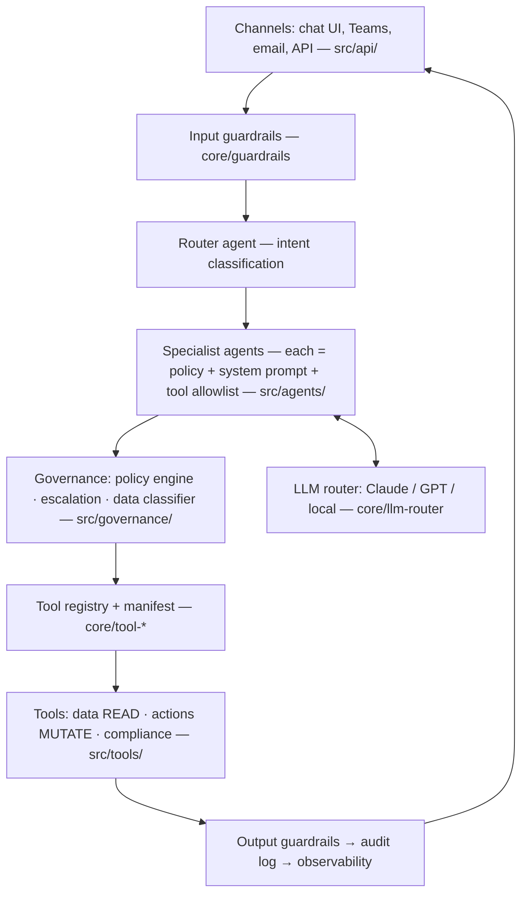
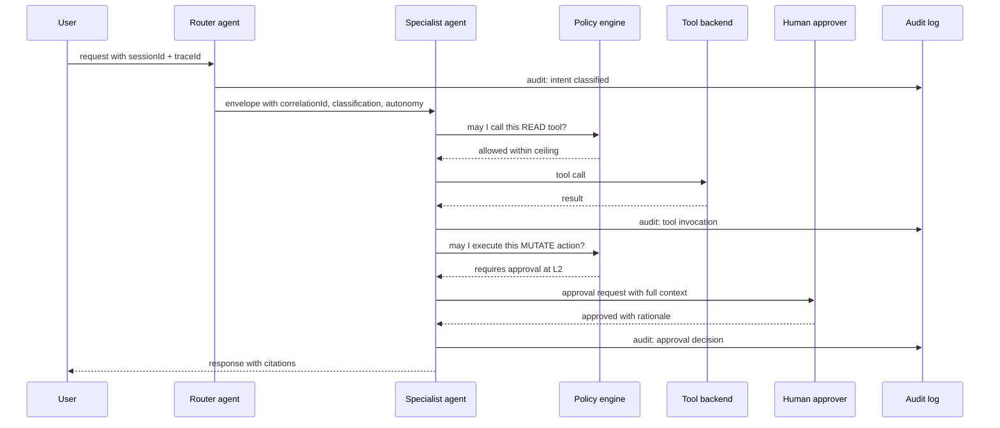
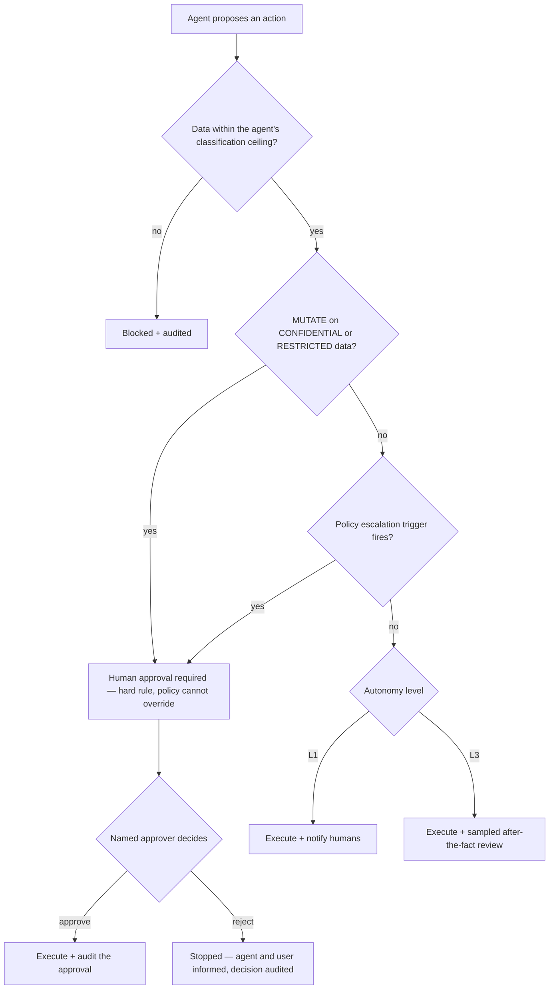
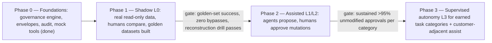

# Running AI Agents in Production in a Regulated Bank

**A playbook for QDB: agents as digital employees — how to build, secure, connect, govern, evaluate, guardrail, observe, and version them.**

This document is the operating manual behind the `qdb-agent-framework` reference implementation in this repository. Each section explains the principle, the industry-standard practice, how the framework implements it today (with file references), and what remains to be done before true production deployment in a regulated environment.

---

## 1. The Operating Model: Agents as Digital Employees

The CEO's framing — "agents as employees/consultants" — is exactly the right mental model for a regulated institution, because everything a bank already knows how to do with *people* transfers to agents:

| HR concept | Agent equivalent | Where it lives in this framework |
|---|---|---|
| Job description | Agent policy: scope, domains, allowed/denied tools | `policies/*.yaml` (`scope`, `allowed_tools`, `denied_tools`) |
| Employment contract | Versioned policy signed off by an owner team | `owner_team`, `version` fields in policy YAML |
| Access badge / system accounts | Non-human identity with least-privilege entitlements | `src/api/middleware/auth.ts` (needs workload identity — see §3) |
| Delegation of authority matrix | Autonomy levels (L0–L3) with overrides per operation | `autonomy` block in policies; `src/governance/escalation.ts` |
| Line manager | Human owner who approves escalations | `escalation.rules[].notify` roles |
| Probation period | Shadow mode → assisted mode → supervised autonomy | §10 maturity roadmap |
| Performance review | Continuous evaluation suite + KPI dashboards | §6 (largest current gap) |
| Code of conduct | System prompt + guardrails | `system_prompt` in policy; `src/core/guardrails.ts` |
| Timesheet / activity log | Immutable audit trail of every action | `src/core/audit-logger.ts` |
| Disciplinary process | Kill switch, policy revocation, rollback | §9 |
| Offboarding | Deregistration, credential revocation, context destruction | `context_policy.clear_context_on_completion` |

**The key organizational decision:** every agent must have a named human owner (an "agent manager") who is accountable for its actions, exactly as a manager is accountable for a direct report. An agent with no owner is shadow IT. The `owner_team` field in every policy file makes this mandatory at the schema level (`src/governance/policy-engine.ts` rejects policies without it).

**What regulators will ask first:** "Who is accountable when the agent is wrong?" The answer must never be "the model." It is always the owner team, operating within a documented delegation-of-authority framework. Agents do not have accountability; they have *authority levels*, delegated and revocable.

---

## 2. Build: Reference Architecture

### 2.1 Principles

1. **Small, specialized agents over one super-agent.** Each agent gets a narrow job description (one policy file), which makes scope, testing, and audit tractable. The router agent (`src/agents/router/`) classifies intent and dispatches — a pattern equivalent to a front-office triage desk.
2. **Deterministic orchestration around non-deterministic reasoning.** The LLM decides *what to say and which tool to request*; deterministic code decides *whether it is allowed to*. Policy enforcement, escalation, and audit are plain code (`src/governance/`), never delegated to the model. In a regulated setting this is non-negotiable: you cannot certify a prompt, but you can certify an enforcement engine.
3. **Graph-based workflows for multi-step processes** (`src/core/graph-engine.ts`): explicit nodes and edges rather than free-form agent loops, so every path through a workflow is enumerable — which is what an auditor needs.
4. **Provider abstraction** (`src/core/llm-router.ts`): route classification tasks to fast/cheap models and reasoning tasks to frontier models, and keep the option of local models (Ollama) for data that must not leave the country. Qatar data-residency requirements (PDPPL, QCB expectations) make Azure Qatar-hosted or on-prem inference the default for CONFIDENTIAL/RESTRICTED data.
5. **Typed contracts everywhere.** Structured output with schema validation (`src/core/structured-output.ts`, Zod schemas throughout) — an agent's output is only accepted if it parses. Free-text glue between systems is where hallucinations become incidents.

### 2.2 The layers

Every hop is mediated: nothing goes from model to tool, or agent to agent, without passing the policy engine and emitting an audit record.

### 2.3 Build vs. buy

Use managed platforms (Azure AI Foundry / AWS Bedrock Agents / Claude Agent SDK) for the runtime where possible, but **own the governance layer yourself**. Vendors give you agents; they do not give you your delegation-of-authority matrix, your Sharia screening rules, or your QCB reporting obligations. The pattern in this repo — thin agents, thick governance — survives any vendor migration.

---

## 3. Secure

Threat model for agents = classic app-sec threats **plus** three new classes: prompt injection, excessive agency, and data exfiltration through model context. Reference: OWASP Top 10 for LLM Applications (LLM01 Prompt Injection, LLM06 Excessive Agency, LLM02 Sensitive Information Disclosure).

### 3.1 Identity: agents are non-human identities (NHI)

- Each agent gets its **own workload identity** (Entra ID managed identity / service principal on Azure) — never a shared API key, never a human's credentials. The agent's identity, not the calling user's, is what tool backends authorize — combined with the *user's* entitlements passed through the envelope (`metadata.userId`) so an agent can never do for a user what the user couldn't do themselves ("confused deputy" prevention).
- Short-lived credentials only; secrets in Key Vault; rotation automated.
- **Gap in current framework:** `src/api/middleware/auth.ts` handles inbound API auth, but agents don't yet carry distinct outbound identities. Before production, each agent's tool calls must be authenticated as that agent so entitlement review works per-agent, like per-employee access review.

### 3.2 Least privilege via tool allowlists

The single most effective control. An agent physically cannot call a tool that is not on its allowlist — enforced in code, not in the prompt:

- `allowed_tools` / `denied_tools` in every policy (see `policies/it-operations.yaml`, which denies `qdb.data.query_core_banking` to the IT agent).
- The tool registry (`src/core/tool-registry.ts`) resolves calls only against the agent's policy; the manifest (`src/core/tool-manifest.ts`) declares each tool's `operationType` (READ/MUTATE) and maximum data classification.
- Treat the tool list like an access-review artifact: quarterly recertification by the owner team, same as user access review.

### 3.3 Data classification boundaries

Every message envelope carries a `dataClassification` (PUBLIC → INTERNAL → CONFIDENTIAL → RESTRICTED), and every policy declares `data_boundaries.max_classification`. The data classifier (`src/governance/data-classifier.ts`) tags content; the policy engine blocks an agent from handling data above its clearance — the same concept as employee security clearance. PII handling per policy (`pii_handling: MASK`).

### 3.4 Prompt injection defense in depth

No single control stops injection; layer them:

1. Input guardrails pattern-match known injection markers (`src/core/guardrails.ts` `INJECTION_PATTERNS`) — necessary but weakest layer.
2. **Privilege containment is the real defense:** even a fully hijacked agent can only call its allowlisted tools at its data clearance with its autonomy ceiling. Design so that the worst-case injected instruction is *bounded*, not prevented.
3. Treat all retrieved content (documents from ECM, web pages, emails) as untrusted data, never as instructions; keep it in clearly delimited context.
4. MUTATE operations always require approval at CONFIDENTIAL+ (hard rule in `src/governance/escalation.ts`), so injection cannot cause an unreviewed state change on sensitive data.

### 3.5 The rest of the checklist

- Output guardrails scan for PII/secrets leaving the system (§7).
- Rate limiting per agent and per user (`src/api/middleware/rate-limit.ts`) — an agent that loops is a denial-of-wallet and a flood risk.
- Sandboxed execution for any code-running tools (none in this repo yet — keep it that way until there's a container-isolated executor).
- Pen-test the agent surface: red-team exercises specifically for injection → exfiltration chains, before go-live and annually. QCB will expect this in the same bucket as application penetration testing.

---

## 4. Communicate: Agent ↔ Agent and Agent ↔ Human

### 4.1 Agent-to-agent

All inter-agent traffic uses one immutable, schema-validated envelope (`src/core/message-envelope.ts`) over a message bus (`src/core/message-bus.ts`). The envelope is the contract that makes multi-agent systems auditable:

- `messageId` / `correlationId` / `parentMessageId` — full causal chain reconstruction ("which user request caused this agent to call that tool?").
- `sourceAgent` / `targetAgent` / `action` / typed `payload` — no free-text agent chatter.
- `dataClassification`, `requiresApproval`, `autonomyLevel` — governance metadata travels **with** the message, so a downstream agent cannot silently launder restricted data or escalate autonomy.
- `ttlSeconds` — messages expire; no stale instructions executing hours later.

A full request, end to end — every governance touchpoint and audit event on one picture:

Industry direction: MCP (Model Context Protocol) for agent→tool connectivity and A2A-style protocols for agent→agent. The envelope pattern here maps cleanly onto both — adopt MCP for tool integration as connectors mature (core banking, ECM, Power BI already have mock tool shapes in `src/tools/data/`), but keep the governance envelope as your internal standard: open protocols carry the message, your envelope carries the *authority context*.

### 4.2 Agent-to-human: the autonomy ladder

Codified as `AutonomyLevel` in `src/core/types.ts` and enforced by `src/governance/escalation.ts`:

| Level | Meaning | Analogy |
|---|---|---|
| **L0_SHADOW** | Agent produces output; nothing is shown/executed. Humans compare after the fact. | Intern shadowing |
| **L1_NOTIFY** | Agent acts on read-only tasks, notifies humans of everything | New hire on supervision |
| **L2_APPROVE** | Agent proposes; a named human approves before execution | Maker-checker (four-eyes) |
| **L3_AUTONOMOUS** | Agent executes within policy; sampled review after the fact | Delegated authority with audit |

Rules that must stay hard-coded (they are, in `escalation.ts`):

- MUTATE + CONFIDENTIAL/RESTRICTED → always L2 (human approval), regardless of policy.
- Policy `overrides` can only *lower* autonomy for a condition, never raise it above the policy ceiling.
- Approval requests go to **named roles** (`notify: ["it_manager", "cio"]`), with the full envelope and reasoning attached — an approver who can't see *why* is a rubber stamp, which an auditor will flag.
- Approvals are logged as first-class audit events (approver, timestamp, decision, rationale).

How every proposed action is decided, as enforced in `escalation.ts`:

**Human-side design matters as much as agent-side:** approval fatigue is the failure mode. If a role receives hundreds of approvals daily, humans stop reading them. Track approval volume and override rate per role; if >95% of requests are approved without modification for a task category over a sustained period, that's the data-driven case for promoting that category to L3 — via change management (§9), not by editing a prompt.

### 4.3 Talking to end users

- Agents identify themselves as agents. No impersonating humans — a legal/regulatory requirement in a growing number of jurisdictions and basic trust hygiene everywhere.
- Streaming responses (`src/core/streaming.ts`) with visible status ("checking Azure Monitor…") so users understand what the agent is doing.
- Every user-facing answer that draws on internal data cites its sources (tool + record), so a human can verify. Uncited claims are how hallucinations enter official records.

---

## 5. Govern

### 5.1 Regulatory mapping for QDB

| Regime | What it demands of agents | Framework hook |
|---|---|---|
| **QCB regulations & guidelines** (incl. its AI guideline for the financial sector) | Board-approved AI governance framework, model inventory, human oversight, explainability, exit strategy per system | Policy registry = inventory; autonomy ladder = oversight; audit trail = explainability evidence |
| **Qatar PDPPL (Law 13/2016)** | Lawful basis, data minimization, security of personal data, cross-border transfer controls | Data classifier + `pii_handling` + residency-aware LLM routing |
| **NCSA / NIA policy** | National information-assurance controls, incident reporting | Observability + audit + incident runbooks |
| **Sharia governance** (for Islamic finance products) | Sharia-compliance screening of recommendations | `src/tools/compliance/check-sharia.ts`; Sharia board reviews agent policies touching product decisions |
| **Model risk management** (Basel-style, SR 11-7 as the global reference) | Model inventory, independent validation, ongoing monitoring, documented limitations | §6 evaluation + §9 versioning provide the artifacts |
| **EU AI Act (as international benchmark)** | Credit-decision AI = high-risk: risk management system, data governance, logging, human oversight, accuracy/robustness, **fairness/non-discrimination**, technical documentation | Maps closely to the high-risk control set — several controls remain gaps (outbound agent identity §3.1, evals §6, DLP-grade PII §7.3, and fairness testing) |

QDB is a development bank, not a commercial deposit-taker, but QCB supervision and PDPPL still apply, and adopting the high-risk-AI control set positions QDB ahead of where regional regulation is clearly heading.

### 5.2 The governance operating structure

1. **AI Governance Committee** (CIO/COO/CRO/Compliance/Sharia representation): approves each new agent, each autonomy promotion, and each material policy change. Meets monthly; emergency path for kill-switch decisions.
2. **Agent owner teams**: day-to-day accountability, first-line approvals, policy maintenance. Named in every policy file.
3. **Independent validation** (risk function): evaluates agents before deployment and periodically after — must be organizationally separate from the builders, exactly like model validation vs. model development in credit risk.
4. **The policy file is the governance artifact.** Everything the committee approves is expressible in the YAML: scope, tools, autonomy, escalation, data boundaries, context lifetime. Git history of `policies/` *is* the approval record when combined with protected branches + required reviews (§9).

### 5.3 The three questions every agent deployment must answer in writing

1. **What is the worst thing this agent can do if fully compromised?** (bounded-blast-radius analysis — its tools × its data clearance × its autonomy ceiling)
2. **Who reviews its work, how often, and against what standard?**
3. **How do we turn it off, and what happens to in-flight work when we do?**

---

## 6. Evaluate

**This is the largest gap between the current framework and production readiness.** The repo has a substantial deterministic test suite covering the *deterministic* machinery (policy enforcement, envelope validation, audit completeness, adversarial guardrails — `tests/governance/`, `tests/unit/`) which is the right foundation, but production agents need evaluation of the *non-deterministic* behavior too.

### 6.1 The evaluation stack (build in this order)

1. **Golden datasets per agent.** 50–200 real (anonymized) task examples per agent with expected outcomes, curated by the owner team and refreshed quarterly. For the router: intent → correct target agent. For IT ops: incident text → correct severity + correct playbook. These are the agent's "performance objectives."
2. **Deterministic assertions first.** Did it call an allowed tool? Did output parse against schema? Did it escalate when the scenario required it? Did it refuse out-of-scope requests? These are cheap, objective, and cover the compliance-critical behaviors. Extend the existing vitest suites — the simulation harness (`scripts/simulate-workflow.ts`) is the natural place to replay golden scenarios.
3. **LLM-as-judge for quality dimensions** (accuracy, groundedness in retrieved data, tone) — useful but never the *only* gate for a regulated decision; judges are themselves models and drift. Calibrate the judge against a sample of human ratings quarterly.
4. **Human evaluation on samples.** In L0/L1 phases, humans grade a statistically meaningful sample weekly; this doubles as the evidence file for autonomy promotion.
5. **Adversarial evaluation.** A standing red-team suite: injection attempts, out-of-scope requests, PII-extraction attempts, Sharia-noncompliant product requests. The agent must *fail safely* on all of them, and this suite runs on every change.

### 6.2 When evaluations run

- **Pre-merge (CI):** full deterministic suite + golden dataset regression on every change to prompts, policies, tools, or model version. A prompt edit is a code change; it does not ship without passing evals.
- **Pre-promotion:** independent validation runs the full stack, including adversarial, before any autonomy-level increase.
- **Continuously in production:** sample live traffic (with consent/policy cover) into the eval pipeline; monitor for drift in escalation rate, tool-error rate, override rate, and judge scores. Model providers update models; your evals are how you notice.

### 6.3 KPIs per agent (the "performance review")

Task success rate, escalation rate, human-override rate (approvals modified/rejected), guardrail-violation rate, latency, cost per task, and — most important for the "agents as employees" narrative — *cycle-time and quality deltas vs. the pre-agent baseline*. Report to the governance committee monthly.

---

## 7. Guardrails

Guardrails are the runtime enforcement layer that runs on **every** input and output, independent of what the model wants to do (`src/core/guardrails.ts`).

### 7.1 The four guardrail surfaces

1. **Input guardrails** (before the LLM sees anything): injection-pattern blocking, topic/scope filters, input-size limits, classification tagging.
2. **Output guardrails** (before anything leaves): PII/secret detection and masking, toxicity, claims-without-citation on data-backed answers, schema validation.
3. **Tool-call guardrails** (before execution): the policy engine — allowlist, classification ceiling, operation-type rules, autonomy check. This is where guardrails and governance meet; it's the strongest surface because it gates *actions*, not just words.
4. **Behavioral limits:** max turns per task, max tool calls per task, token/cost budget per session, session TTL (`context_policy` in every policy). A runaway loop hits a hard wall, not a soft prompt suggestion.

### 7.2 Severity model

`BLOCK` / `WARN` / `INFO` (as implemented): BLOCK stops the action and audits; WARN proceeds and audits; INFO audits silently. Tuning guidance: start strict (over-block), then relax based on false-positive review — the reverse direction (start loose, tighten after an incident) is how banks end up in the news.

### 7.3 What to add before production

- Replace regex-only PII detection with a proper detector (e.g., Presidio or a cloud DLP API) — regexes miss Arabic-script names, QIDs in prose, and IBAN variants.
- Prompt-injection classifiers (model-based) alongside the pattern list.
- Guardrail decisions in the audit log with full context so false positives are reviewable (partially present — ensure every BLOCK writes an audit event).

---

## 8. Observe

Rule of thumb from regulated ML: **if you can't reconstruct it, you didn't govern it.** Two distinct systems, both present in skeleton form:

### 8.1 Audit trail (compliance record)

`src/core/audit-logger.ts` — every tool invocation, escalation, approval, guardrail violation, and policy decision becomes an immutable audit event tied to `traceId`/`correlationId`. Production requirements:

- **Append-only, tamper-evident storage** (WORM storage / ledger table), retained per QCB record-keeping requirements (align with the bank's existing 10-year document retention).
- Must capture: who (user + agent identity), what (action + full input/output payload references), when, under which policy **version**, with which model **version**, and which human approved.
- Queryable by case: "show me everything that happened for correlation X" — `src/api/routes/audit.ts` is the start of this; extend into the compliance team's tooling.

### 8.2 Operational telemetry

`src/core/observability.ts` — OpenTelemetry traces and metrics on every agent action, span-per-tool-call, exportable to Azure Monitor / Datadog / Jaeger. Production additions:

- **Dashboards per agent**: request volume, latency percentiles, error rates, token spend, escalation and override rates.
- **Alerting on behavioral anomalies**, not just errors: sudden spike in guardrail BLOCKs (attack or regression), spike in escalations (scope drift), drop in task success, cost anomaly (loop). Route to the owning team like any production service — agents are on-call-able systems.
- **LLM-specific traces**: record prompt/completion (with PII masking) per span so an engineer can replay exactly what the model saw. This is also your eval-data mining source.

### 8.3 The reconstruction test

Quarterly drill: pick a random production task and require the team to produce, from logs alone: the user request, every agent hop, every tool call with inputs/outputs, every policy decision, the model + prompt + policy versions involved, and the human approvals. If reconstruction takes more than an hour, observability has a gap. This drill is also exactly what a regulator's on-site inspection looks like.

---

## 9. Version and Change Management

An agent's behavior is the product of **five independently-versioned artifacts** — a change to any one is a change to the agent:

| Artifact | Versioning mechanism | Current state |
|---|---|---|
| Policy (scope, tools, autonomy) | Semver in YAML (`version: "1.0.0"`, schema-enforced) + git history | ✅ implemented |
| System prompt | Lives inside the policy file → same versioning | ✅ implemented |
| Tools | Manifest entries with versions; contract tests per tool | partial (`tool-manifest.ts`) |
| Model | Pinned model IDs in the LLM router — never "latest" in production | ⚠️ pin explicitly per agent |
| Code (runtime, guardrails, governance) | Normal SDLC: git, CI, releases | ✅ implemented |

### 9.1 Change control rules

- `policies/` on a protected branch: changes require review by the owner team **plus** (for autonomy or tool-list changes) governance sign-off. The git log then doubles as the regulator-facing change record.
- **Model upgrades are treated like vendor system upgrades:** run the full eval suite (§6) against the new model version in shadow, compare KPIs, get sign-off, then cut over with rollback ready. Never auto-upgrade an agent that holds L2+ authority.
- Every audit event records the policy version + model ID in force at the time (add these fields to the audit event if not present) — otherwise historical decisions can't be explained after an upgrade.
- **Rollback is a first-class operation:** previous policy version + previous model pin, deployable in minutes. Practice it.

### 9.2 Kill switch

Three levels, all pre-built and drilled:

1. **Per-agent disable** — deregister from router; in-flight tasks drain to humans (admin route exists: `src/api/routes/admin.ts`).
2. **Autonomy downgrade** — drop any agent to L1/L0 instantly without disabling it (config flag, no deploy).
3. **Global stop** — all agents to L0, message bus paused. This is the button the governance committee owns.

---

## 10. The Maturity Roadmap (how to actually roll this out)

**Phase 0 — Foundations (done in this repo):** governance engine, envelopes, audit, guardrails, two internal agents (IT ops, PMO) against mock tools.

**Phase 1 — Shadow (L0), internal domains, ~3 months:** connect real read-only data sources (Azure Monitor, ECM, Power BI) with per-agent identities (§3.1); agents produce outputs humans compare against their own work; build golden datasets from the comparisons; stand up dashboards. *Success gate:* task success ≥ target on golden set; zero guardrail-BLOCK bypasses; reconstruction drill passes.

**Phase 2 — Assisted (L1/L2), internal operations:** agents answer and propose; humans approve mutations. IT ticket triage, PMO status reporting, internal knowledge queries. Track override rates as the promotion evidence base. This is where the "digital consultant" value shows up first and where the organization learns to *manage* agents.

**Phase 3 — Supervised autonomy (L3) for low-risk categories + first customer-adjacent use:** promote specific task categories with sustained >95% unmodified-approval rates; introduce customer-facing assistance (never customer-facing *decisions*) with disclosure. Credit-assessment support (`policies/credit-assessment.yaml`) stays decision-support only: the agent assembles, checks Sharia/QCB constraints (`src/tools/compliance/`), and drafts — a human credit officer decides. In most regimes (and under the EU AI Act benchmark) automated credit decisions are the highest-risk category; keep humans as the deciders indefinitely unless the governance committee and regulator engagement say otherwise.

Each promotion = evidence pack (eval results, KPI history, incident record) → independent validation → governance committee sign-off. Autonomy is earned per task category, not granted per agent.

---

## 11. Production-Readiness Checklist (condensed)

**Before any real data:** per-agent workload identities · secrets in vault · DLP-grade PII detection · data-residency routing enforced · pen test incl. injection red-team.

**Before L2:** approval UX with full context · approval audit events · eval suite in CI with golden datasets · dashboards + anomaly alerts · kill switch drilled · policy branch protection + governance sign-off flow.

**Before L3:** independent validation report · sustained override-rate evidence · adversarial suite green across 2+ model versions · reconstruction drill under 1 hour · board-level AI governance framework approved (QCB expectation).

---

*Maintained alongside the framework. Changes to this playbook that alter governance requirements follow the same review path as changes to `policies/`.*
